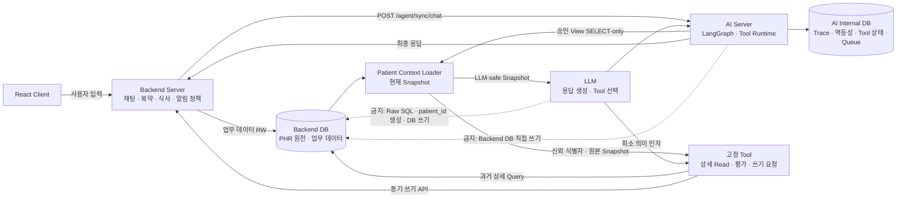
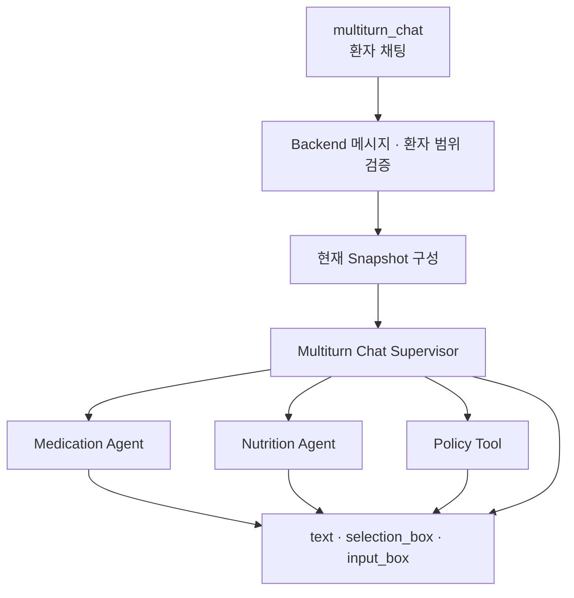
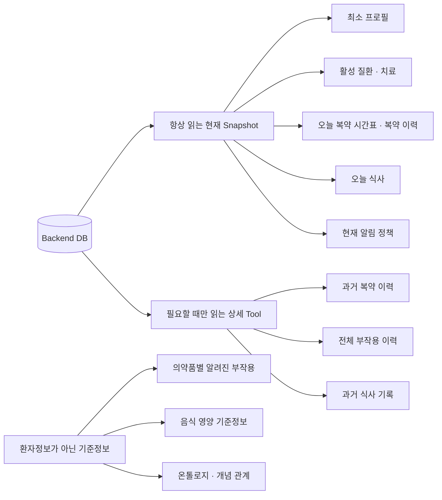
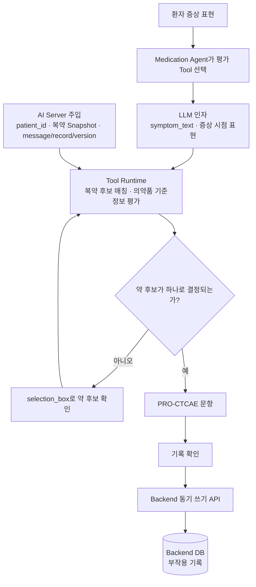
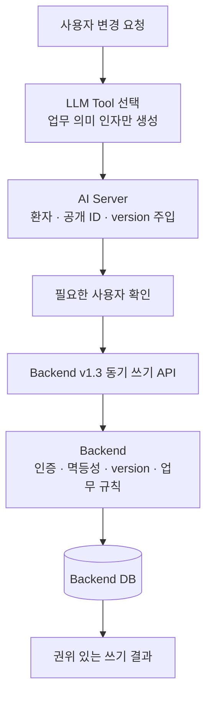

# Agent System Map

## 전체 구조

Backend DB가 환자정보와 업무 데이터의 원장입니다. AI Internal DB에는 환자
업무 원장을 복제하지 않고, AI 실행에 필요한 Trace와 상태만 저장합니다.

현재 v1.3 채팅은 Backend Patient Snapshot을 사용합니다. 과거 테스트베드의
별도 PHR 서비스·DB·환자키 발급 흐름은 제거되었으며 채팅 선행조건이 아닙니다.

## 동기 채팅 입력

채팅에 필요한 Tool continuation은 같은 `/agent/sync/chat` 요청, 내부 Trace,
전체 timeout 안에서 최종 응답까지 완료합니다. 중간 안내문이나 비동기 채팅
결과를 성공 응답으로 반환하지 않습니다.

## 현재 Snapshot과 상세 Read

`available`, `not_found`, `not_supported`, `unavailable` 상태를 구분하며,
일부 정보가 없다는 이유로 전체 PHR이 미등록됐다고 답하지 않습니다.

## 부작용 평가와 저장

부작용 Tool은 별도 PHR 환자키로 환자 약을 다시 조회하지 않습니다. 같은 채팅
요청에서 구성한 신뢰 Snapshot을 재사용하고, 환자가 과거 시점을 명시해 현재
Snapshot만으로 부족할 때만 환자 범위가 고정된 상세 Read Tool을 실행합니다.
평가 결과 저장은 AI DB나 별도 PHR DB가 아니라 Backend 동기 쓰기 API를 통해
Backend DB에 반영합니다.

## 정책과 기록 변경

## 중요한 규칙

- LLM은 증상 원문·시점처럼 사용자 표현에 가까운 최소 인자만 생성합니다.
- `patient_id`, 메시지 ID, 기록 ID, version은 AI Server가 신뢰 컨텍스트에서
  주입하며 모델 Tool 인자로 노출하지 않습니다.
- 모든 Tool 입력 스키마는 정의되지 않은 추가 속성을 허용하지 않습니다.
- 과거 상세 조회는 고정된 parameterized query만 사용합니다.
- Backend Read 전체 장애 또는 환자 범위 검증 실패 시 LLM을 호출하지 않습니다.
- 일부 Snapshot 도메인만 사용할 수 없으면 해당 정보를 요구하는 개인화 판단과
  Tool 실행만 제한합니다.
- 업무 쓰기는 Backend 동기 API를 통하며, AI Server는 Backend DB에 직접 쓰지
  않습니다.
- 사용자 확인이 필요한 변경은 확인 전에 적용 성공으로 표현하지 않습니다.
- 다음 채팅 요청에서는 Snapshot을 새로 읽습니다. 같은 요청에서 쓰기가 발생한
  뒤에는 쓰기 응답을 권위 있는 최신 결과로 사용합니다.
