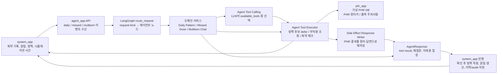
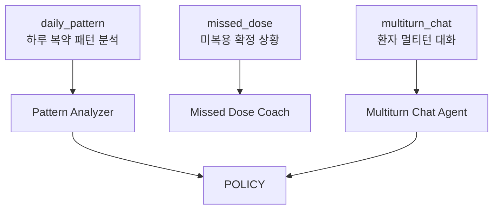
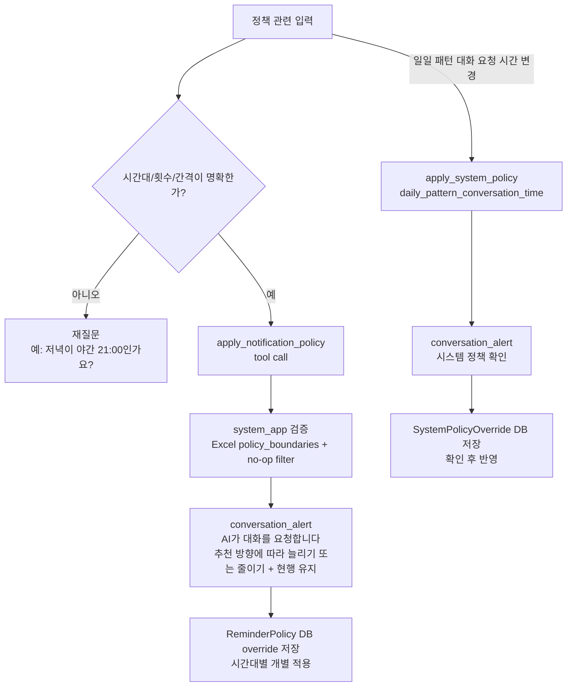
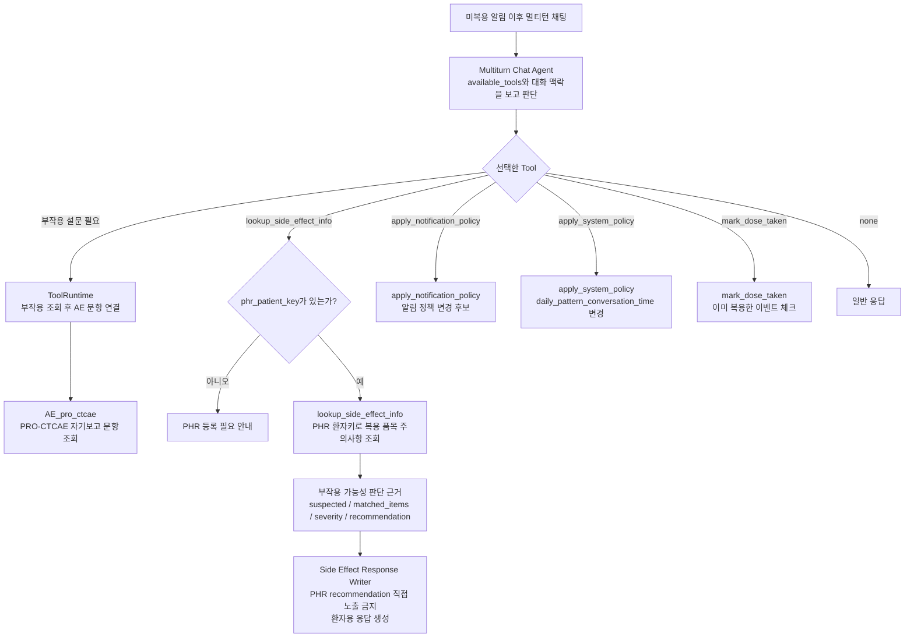

# Agent System Map

현재 에이전트 시스템은 크게 보면 아래처럼 움직입니다.

## 입력 3종류

## 노드별 역할

- `route_request`: 요청 종류를 보고 어느 에이전트 노드로 보낼지 결정합니다.
- `Pattern Analyzer`: 하루 복약 패턴에서 누락이 반복되는 시간대를 찾습니다.
- `Policy Planner`: 정책 전문 agent입니다. 패턴 분석 결과나 복합 알림 정책 요청을 `apply_notification_policy` tool_calls 리스트로 구조화합니다.
- `Missed Dose Coach`: 미복용 이유와 증상 확인 질문을 만듭니다.
- `Side Effect Response Writer`: PHR 조회 결과를 최종 사용자 문장으로 재작성합니다.

## 정책 변경 흐름

## 부작용 조회 흐름

## 중요한 규칙

- 에이전트는 정책/부작용 판단에 필요한 Tool Calling을 직접 실행합니다.
- 정책 Tool은 직접 적용 API를 호출하지 않고 확인용 후보로 defer됩니다. 부작용 Tool은 `phr_app`, 복약 완료 Tool은 `system_app`을 호출합니다.
- 부작용 Tool은 앱 내부 `patient_id`가 아니라 PHR이 발급한 `phr_patient_key`로만 환자 복용 품목을 조회합니다.
- PHR의 `recommendation`은 내부 판단 근거입니다. 최종 환자 답변에는 직접 붙이지 않고, `side_effect_response_writer`가 읽고 자연스러운 환자용 문장으로 다시 씁니다.
- 미복용 알림 답변은 전용 단답 라우터를 쓰지 않고, `multiturn_chat` 경로에서 이어집니다.
- daily pattern 분석과 새 미복용 알림 생성에는 이전 미복용 알림의 환자 답변/AI 응답 요약과 최근 대화 맥락이 함께 들어갑니다. 다만 이전 증상을 새 미복용 사건의 현재 증상처럼 단정하지 않도록 프롬프트에서 제한합니다.
- 환자 멀티턴 대화에서는 증상/부작용 확인 시 `lookup_side_effect_info`를 먼저 호출하고, 관련 가능성이 확인되면 `ToolRuntime`이 `AE_pro_ctcae`를 이어서 호출합니다. 알림 정책 변경 요청 시에는 `apply_notification_policy`, 일일 패턴 대화 요청 시간 변경 요청 시에는 `apply_system_policy` 도구 호출을 내지만 둘 다 환자 확인 전에는 적용되지 않습니다.
- `AE_pro_ctcae` 호출 인자는 환자 표현에 가까운 `symptom_text`와 매칭용 대표 증상명 `symptom_normalize`를 함께 담습니다. 예: “속이 메스꺼운데 부작용일까?” → `symptom_text=속이 메스껍다`, `symptom_normalize=메스꺼움`.
- `AE_pro_ctcae`가 `Parsed_Items`에서 유의미한 증상을 찾지 못하면 `Other_Symptoms` 시트의 generic fallback 문항을 반환합니다. 이 단계는 추가 증상 매칭이 아니라 기타 증상 보고용 fallback입니다.
- 정책 변경 확인도 미복용 대화처럼 `AI가 대화를 요청합니다.` 알림으로 표시하고, 사용자는 `채팅 열기`로 이동해 Chat 안의 선택지를 누릅니다.
- Chat 아래 대화 이력에는 화면에 표시된 알림 기록도 함께 남깁니다.
- 환자가 “먹었는데 기록을 깜빡했다”고 명확히 답하면 `mark_dose_taken` 도구 호출로 해당 복약 이벤트를 완료 처리합니다.
- `저녁`처럼 실제 일정과 애매하게 매칭되는 표현은 바로 적용하지 않고 되묻습니다.
- 여러 시간대 정책이 동시에 바뀌어도 표시, audit, 백그라운드 처리는 시간대별로 따로 남깁니다.
- 최종 적용은 항상 `system_app`이 검증하고 환자 확인을 받은 뒤 수행합니다.
- 정책 허용 범위는 전역 slot 기준이 아니라 `policy_boundaries.policy_key` 기준으로 관리합니다. 최종 resolved policy의 `policy_key`와 같은 boundary 행만 해당 정책 후보 검증에 사용됩니다.
