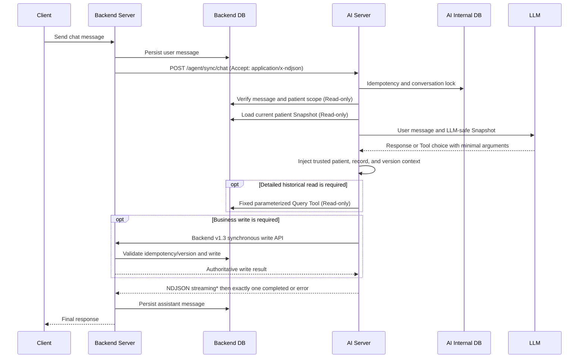

# Architecture

## Active service boundary

- `system_app` (Backend Server)
  - Owns patient profiles, active conditions and treatments, medication schedules,
    dose events, meals, notifications, chat history, and policy records.
  - Persists the user message before calling the AI Server.
  - Calls the v1.3 chat API synchronously and persists only its final response.
  - Applies record and notification-policy writes through the Backend v1.3
    synchronous write APIs.
  - Serves the React application.

- `agent_app` (AI Server)
  - Owns LLM orchestration, MCP Tool execution, and non-chat async tasks.
  - Connects to approved `ai_v13_*` Backend DB Views with a Read-only account.
  - Builds a current patient Snapshot before each synchronous chat invocation.
  - Reuses the trusted Snapshot in Tool Runtime; the model does not supply
    `patient_id`, record IDs, or versions.
  - Requests all business writes through Backend synchronous APIs.

- AI Internal DB
  - Owns AI request idempotency, conversation locks, Trace, Tool execution state,
    feedback state, and async queue state.
  - Is the sole ledger for synchronous and asynchronous Agent Trace, failed
    Trace, token usage, estimated cost, Step, and Tool execution evidence.
  - Assigns those observability rows a fixed 3-year expiry. Only hashes and
    redacted metadata are retained; raw clinical text is not Trace data.
  - Is not a patient, medication, meal, side-effect, or policy source of truth.
  - Atomically records a PHI-free Langfuse outbox with each completed/failed
    attempt. A separate exporter sends one logical trace with nested retry
    attempts; Langfuse availability never changes the Agent result.

- Backend DB
  - Is the source of truth for PHR and other patient business data.
  - Exposes only contract-approved Views to the AI Read-only role.
  - Keeps messages, business state, Agent jobs, callback receipts, and minimal
    decision/API audits, but does not duplicate Agent Trace or Step rows.

The standalone PHR service, database, registration key, settings, and
compatibility tests from the earlier testbed flow have been removed. The
Backend Patient Snapshot is the only active patient-information path.

## Synchronous chat and Snapshot flow



The AI Server does not expose a separate `/agent/sync/chat/stream` route.
Each NDJSON event echoes the Backend-issued `request_id` and user `message_id`;
`sequence` starts at 0 and increments by one. Reasoning, Tool calls, and Tool
results stay internal. The Backend persists an assistant message only after a
valid `completed` event.

The current Snapshot includes:

- minimum patient profile
- active conditions and treatments
- today's medication schedules and dose-event history
- today's meals
- currently effective notification policies

Past medication history, complete side-effect history, and past meal history are
loaded only through bounded detailed-read Tools. Medication side-effect and food
nutrition reference data are not patient records and are kept outside the
patient Snapshot.

## Partial data and failure behavior

- `available`: use the domain in personalized reasoning.
- `not_found`: the query succeeded but no current record exists.
- `not_supported`: the current contract does not expose that domain.
- `unavailable`: do not make claims or execute a Tool that requires the domain.
- Complete Backend Read failure or patient/message scope verification failure:
  do not invoke the LLM; return the contract error.

The system must not collapse these states into “PHR is not registered.”

## Background work

```mermaid
flowchart TB
    backend["Backend Server"] -->|"POST /agent/async/missed-dose-events<br/>request_id + patient_id + dose_event_id"| missedQueue["AI missed-dose queue"]
    missedQueue --> worker["agent worker"]
    worker -->|"Read-only event + A-E feedback policy lookup"| backendDb["Backend DB"]
    worker --> graph["LangGraph orchestrator"]
    graph -->|"One no-tool LLM message generation"| missedCallback["Backend missed-dose callback"]
    graph -->|"redacted Trace·failure"| agentDb["AI Internal DB"]
    missedCallback -->|"Current dose-status gate + policy re-evaluation + message validation"| backendDb
    backendDb -->|"Still missed"| delivery["Notification + chat delivery"]
    backendDb -->|"Already taken / changed"| suppressed["Suppress stale delivery"]

    backendScheduler["Backend 02:00 scheduler"] -->|"patient_id[] + analysis_date"| dailyIntake["POST /agent/async/daily-medication-pattern-analysis"]
    dailyIntake --> dailyQueue["AI daily-pattern analysis queue"]
    dailyQueue --> worker
    graph -->|"proposal exists"| proposalQueue["AI proposal-delivery queue"]
    proposalQueue -->|"POST /api/agent/async/notification-policy-change-proposals"| proposalCallback["Backend proposal callback"]
    graph -->|"no proposal"| agentDb
```

User-facing chat and its required Tool continuation remain synchronous.
Backend-originated external async intake contains the minimal missed-dose
contract and the Backend-owned daily-pattern trigger. Daily-pattern analysis
starts when the Backend submits the active patient batch at 02:00; the AI
Server calls the Backend only when a notification-policy proposal exists.
Worker failures and their diagnostic context remain in the AI Internal DB; the
Backend does not receive a generic failure/result callback.

The Backend remains authoritative for notification eligibility, timing, the A-E
adherence pattern, tone policy, and final delivery. The missed-dose event node
uses one Tool-free LLM call only to generate a short policy-bounded Korean
message. It returns strict JSON, and parse, schema, safety, or provider failures
surface as explicit errors; no stock-message fallback is substituted.

Immediately before delivery, the Backend checks that the dose is still
`missed`, recomputes its policy, and validates the generated message. A dose
already marked taken suppresses the stale alert and creates no chat message.
Side-effect and PRO-CTCAE Tools are available only in the later synchronous
chat path after a patient-authored symptom exists.

## Tool and write rules

- Model-visible Tool schemas use `additionalProperties: false`.
- The model supplies only user-derived semantic values such as symptom text or
  symptom onset expression.
- The AI Server injects patient scope, current medications, message identifiers,
  record identifiers, and versions.
- Backend DB access accepts fixed parameterized queries only; model-generated SQL
  is prohibited.
- Read Tools use only the configured `BackendQueryTools` Read-only DB connection.
  A missing or failed read connection returns an explicit Tool error and never
  falls back to a Backend `/api/agent/*` HTTP read endpoint.
- Backend business writes require Backend authentication, idempotency, and
  optimistic-version validation.
- AI internal `trace_id` is not part of the external Backend business contract.

The legacy Backend Trace ledger has been verified, merged into the Agent
PostgreSQL database, and removed. Agent DB is now the only Trace/Step/Tool
execution ledger. Backend에는 업무 queue인 `agent_jobs`, API 멱등성 receipt인
`backend_api_requests`, 비동기 Callback receipt만 남고 Agent Trace 복제
테이블이나 Trace 식별자는 저장하지 않는다.

## Operations

AI task and readiness state is exposed through:

- `/agent/ops/readiness`
- `/agent/async/tasks/status`
- `/agent/async/tasks`
- `/agent/async/tasks/dead`
- `/agent/async/tasks/{request_id}`

Langfuse export runs as `python -m agent_app.langfuse_exporter_main`. It uses
acknowledged OTLP/HTTP, lease recovery, exponential retry, a circuit breaker,
and terminal `DEAD` state. The self-hosted Langfuse UI and ingestion endpoint
remain inside the administrator network. Field, score, sampling, and deletion
rules are defined in `docs/AGENT_TRACE_LANGFUSE_MAPPING.md`.

The readiness gate must independently verify the AI Internal DB, Backend
Read-only DB contract, Backend write API, authentication, and configured
generation provider. Production procedures are maintained in
`docs/PRODUCTION_READINESS.md`.
