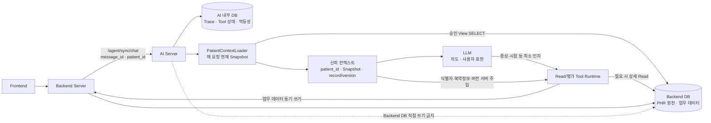
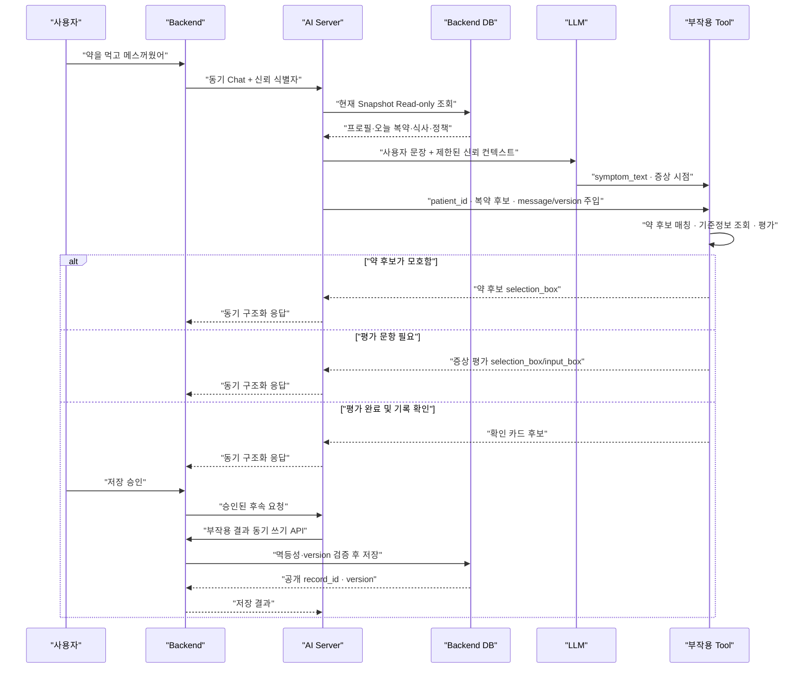

# Backend(PHR) DB 환자정보 Read 경계 확정안

- 작성일: 2026-07-26
- 상태: 사용자 결정 확정
- 범위: AI Server의 Backend DB 직접 Read와 부작용 Tool의 신뢰 컨텍스트
- 비범위: 외부 Chat API v1.3 필드 변경, AI 내부 Trace 상세 설계

## 1. 확정 전제

이 프로젝트에서 PHR DB는 별도 AI 소유 DB가 아니라 **Backend Server가 소유하는
Backend DB의 환자정보 영역**이다.

- 환자 원천정보는 Backend DB로 단일화한다.
- 활성 v1.3 환자정보 경로는 별도 PHR 서비스·DB·환자키에 의존하지 않고
  Backend의 신뢰된 `patient_id`로 통일한다.
- AI Server는 Backend DB의 승인된 View에 Read-only 계정으로 접속한다.
- AI Server는 Backend DB에 직접 쓰지 않는다.
- 기록·복약·정책·부작용 평가 결과 등 모든 업무 데이터 쓰기는 동기 Backend
  API를 통해 수행한다.
- AI 내부 DB는 Trace, Tool 실행 상태, 멱등성 등 AI 실행 상태만 저장한다.
- `patient_id`는 Backend가 전달한 채팅 컨텍스트에서 검증·주입한다. LLM과
  Frontend가 생성하거나 선택하지 않는다.
- 외부 Chat API v1.3에는 Snapshot을 추가하지 않는다. Snapshot은 AI Server
  내부 신뢰 컨텍스트와 Backend DB Read 계약으로 관리한다.

## 2. 현재 코드 반영 상태

AI Server는 메시지 검증과 최근 대화 조회 후 `patient_context_snapshot()`으로
현재 환자 Snapshot을 구성한다. Snapshot은 LLM-safe projection과 Tool Runtime용
trusted context로 나뉘며, 부작용 평가 Tool은 같은 요청의 Snapshot을 재사용한다.

현재 활성 부작용 평가 경로는 별도 PHR 환자키나 PHR HTTP 조회를 요구하지 않고,
AI Server 내부의 비환자 의약품 기준정보와 Backend Snapshot을 사용한다. 평가
결과 저장은 Backend v1.3 동기 쓰기 계약을 사용한다.

과거 테스트베드의 독립 PHR 서비스·설정·등록키·호환 테스트는 제거되었다.

## 3. 목표 처리 구조



### 처리 순서

1. Backend는 저장된 사용자 `message_id`, `patient_id`를
   AI Server에 전달한다.
2. AI Server는 메시지가 해당 환자의 단일 스레드에 속하는지 Backend DB에서
   검증한다.
3. `PatientContextLoader`가 같은 Read-only 연결로 현재 Snapshot을 만든다.
4. Snapshot과 검증된 식별자를 Agent의 신뢰 컨텍스트에 넣는다.
5. LLM은 사용자 의도와 사용자 표현을 판단하고 필요한 Tool만 선택한다.
6. Tool Runtime은 같은 요청에서 이미 읽은 Snapshot을 재사용한다.
7. Snapshot에 없는 과거 상세정보가 필요한 경우에만 고정 Query Tool을 호출한다.
8. 쓰기가 필요하면 확인 정책을 거쳐 Backend 동기 쓰기 API를 호출한다.

상세 Read Tool은 `BackendQueryTools`의 Read-only DB 연결만 사용한다. 해당 연결이
없거나 실패하면 명시적인 Tool 오류를 반환하며, Backend의 `/api/agent/*` HTTP
조회 API로 우회하지 않는다.

## 4. 환자정보 분류 확정

“항상 읽는다”는 말은 모든 과거 원본 행을 LLM에 넣는다는 뜻이 아니다.
아래 현재 도메인을 매 요청의 Snapshot에 빠짐없이 구성한다는 뜻이다.

### 4.1 항상 읽는 현재 Snapshot

- 최소 환자 프로필
- 현재 활성 질환과 치료
- 오늘 복약 정보
  - 오늘 복약 시간표
  - 오늘 복약 이력
- 오늘 식사 정보
- 현재 알림 정책

### 4.2 필요할 때 Tool로 읽는 상세정보

- 과거 복약 이력
- 전체 부작용 이력
- 과거 식사 기록

### 4.3 환자정보가 아닌 기준정보

- 의약품별 알려진 부작용
- 음식 영양 기준정보
- 온톨로지와 개념 관계

알레르기와 음식 선호는 향후 온톨로지·개념 관계와 함께 별도 계약으로 확장한다.
현재 Snapshot에 없는 정보를 빈 값으로 가장하지 않고 `not_supported`로 표시한다.
알레르기 정보가 필요한 안전 판단은 해당 계약이 제공되기 전까지 개인화된
사실을 추정하지 않고 실행을 제한한다.

### 경계 예시

| 질문 또는 작업 | 사용 경로 |
|---|---|
| “오늘 먹을 약과 먹은 약을 알려줘” | 현재 Snapshot |
| “오늘 점심에 무엇을 먹었어?” | 현재 Snapshot |
| “지금 미복용 확인 대화가 켜져 있어?” | 현재 Snapshot |
| “지난주에 약을 몇 번 빠뜨렸어?” | 과거 복약 이력 Tool |
| “지금까지 기록된 부작용을 보여줘” | 전체 부작용 이력 Tool |
| “어제 먹은 식사를 알려줘” | 과거 식사 기록 Tool |
| “암로디핀의 알려진 부작용은?” | 의약품 부작용 기준정보 |
| “이 음식의 나트륨은?” | 음식 영양 기준정보 |

## 5. Snapshot 계약

```json
{
  "patient_context_snapshot": {
    "patient_id": "trusted-backend-patient-id",
    "as_of": "2026-07-26T10:30:00+09:00",
    "read_contract_version": "1.4",
    "availability": {
      "profile": "available",
      "conditions_and_treatments": "available",
      "today_medication": "available",
      "today_meals": "not_found",
      "notification_policies": "available",
      "allergies": "not_supported",
      "clinical_observations": "not_supported"
    },
    "profile": {},
    "active_conditions": [],
    "active_treatments": [],
    "active_medication_schedules": [],
    "today_medication": {
      "schedules": [],
      "dose_events": [],
      "total": 0,
      "totals_by_status": {}
    },
    "today_meals": [],
    "active_notification_policies": []
  }
}
```

- Snapshot은 AI Server 내부의 신뢰 컨텍스트이다.
- Frontend나 외부 Chat v1.3 응답에 원문 그대로 반환하지 않는다.
- 매 동기 채팅 요청마다 Backend가 결정한 `message_at`을 업무 시각으로 사용해
  새로 구성한다. 대화 이력 범위는 물리 `created_at`이나 날짜 필터가 아니라
  read view의 `conversation_sequence`로 현재 user 메시지까지 제한한다.
- 대화 업무 시각 `conversation_at`과 실제 UTC 기록 시각 `recorded_at`은
  분리한다. Agent에 전달하는 대화 시각은 `conversation_at`이며,
  `recorded_at`은 운영·감사 용도다.
- 사용자 사이에 Snapshot을 공유하거나 환자 범위를 넘는 캐시를 사용하지 않는다.
- 오늘의 기준은 Backend와 AI가 합의한 Asia/Seoul 업무 날짜로 계산한다.
- 원본 전체 행이나 불필요한 자유문장을 LLM에 무제한으로 전달하지 않는다.

## 6. LLM·AI Server·Tool 책임 경계

| 책임 주체 | 처리하는 값과 작업 |
|---|---|
| LLM | `symptom_text`, 증상 발생 시점 등 사용자 표현에 가까운 최소 인자 생성, Tool 선택, 구조화 응답 작성 |
| AI Server | `patient_id`, Snapshot, 복약 목록, 오늘 복약 상태, `message_id`, `request_id`, Backend 기록 ID와 version 검증·주입 |
| Tool Runtime | 현재 약 후보 매칭, 의약품별 알려진 부작용 조회, 증상 평가 로직, 모호한 후보의 구조화 선택지 생성 |
| Backend Server | 확인된 쓰기 요청 검증, 멱등성·version 검사, 업무 DB 저장, 공개 ID와 결과 반환 |

### 모델 입력 제한

- LLM Tool `inputSchema`에는 `patient_id`, 복약 목록, 오늘 복약 상태,
  Backend 메시지·기록 ID, version을 노출하지 않는다.
- Tool schema는 `additionalProperties: false`를 유지한다.
- LLM이 기록 ID, version, 환자 식별자를 생성해도 무시하고 계약 오류로 처리한다.
- Tool Runtime은 신뢰 컨텍스트에 없는 환자정보를 모델 출력으로 보충하지 않는다.

## 7. 부작용 평가와 저장 확정 흐름



- Snapshot에서 약이 하나로 특정되면 약 이름을 다시 묻지 않는다.
- 후보가 여럿이면 LLM이 임의 선택하지 않고 `selection_box`로 확인한다.
- 부작용 평가 중간 결과를 별도 PHR DB에 자동 저장하지 않는다.
- 부작용 기록이 확인 대상이면 승인 전에는 업무 레코드를 만들지 않는다.
- Backend 동기 쓰기는 `request_id` 멱등성과 version 충돌 정책을 따른다.

## 8. availability와 실패 정책

| 상태 | 의미 | 처리 |
|---|---|---|
| `available` | 조회 성공, 현재 데이터 존재 | 개인화 판단과 Tool에 사용 |
| `not_found` | 조회 성공, 현재/오늘 데이터 없음 | “기록 없음”으로 설명하고 다른 정보로 대화 계속 |
| `not_supported` | Backend 계약이 아직 해당 도메인을 제공하지 않음 | 지원되지 않는 범위를 명시하고 다른 available 정보로 대화 계속 |
| `unavailable` | 특정 도메인 조회 실패 | 안전하게 답할 수 있으면 제한사항과 함께 LLM 응답 허용; 해당 도메인이 필수인 평가·쓰기는 차단 |

### 전체 장애와 식별자 실패

- Backend Read DB 전체 연결 실패
- 승인 View 계약 불일치
- 메시지·대화·환자 범위 검증 실패

위 경우에는 신뢰할 환자 컨텍스트 자체가 없으므로 LLM과 Tool을 호출하지 않는다.
Backend에 명시적 계약 오류를 반환하고 Frontend는 실패 버블과 같은
`request_id` 재시도를 제공한다. 규칙 기반 또는 preset 답변으로 성공처럼
대체하지 않는다.

### 금지되는 해석

- 조회 결과 0건을 “PHR 환자 정보 전체 미등록”으로 확대 해석하지 않는다.
- `not_supported`를 환자가 해당 정보가 없는 것으로 표현하지 않는다.
- 일부 `unavailable` 상태에서 조회하지 못한 약·식사·질환을 추정하지 않는다.
- 필요한 복약정보가 unavailable인 상태로 부작용 평가나 저장을 실행하지 않는다.

## 9. Backend DB View 권장 구성

하나의 거대한 Join View보다 도메인별 승인 View와 고정 파라미터 쿼리를 사용한다.

### 현재 Snapshot용

- `ai_v13_patient_profiles`
- `ai_v13_active_medication_schedules`
- `ai_v13_dose_events`
- `ai_v13_nutrition_meals`
- `ai_v13_nutrition_foods`
- `ai_v13_reminder_policies`

현재 테스트베드의 활성 질환은 환자 profile, 활성 치료는 복약 schedule의
치료영역에서 파생한다. 운영 Backend가 정규화된 condition/treatment 원장을
제공하면 별도 승인 View로 교체한다.

### 상세 Tool용

- 과거 범위를 지원하는 `ai_v13_dose_events`
- 기존 `ai_v13_side_effect_records`
- 과거 범위를 지원하는 `ai_v13_nutrition_meals`

### 기준정보용

- 의약품 부작용 기준 View 또는 승인된 기준정보 저장소
- 음식 영양 기준 View 또는 승인된 기준정보 저장소
- 향후 온톨로지·개념 관계 View

각 환자정보 View에는 `patient_id`가 있어야 하고 모든 쿼리는 이를 필수 조건으로
사용한다. AI DB 계정에는 View `SELECT`만 부여하고 Backend 원본 테이블 권한은
부여하지 않는다. 기준정보 쿼리에는 임의 SQL이나 모델 생성 SQL을 허용하지 않는다.

## 10. 확정 결정과 남은 정리 항목

| 번호 | 확정 내용 |
|---|---|
| D1 | 환자 원천정보를 Backend DB로 단일화하고 `patient_id`를 사용 |
| D2 | AI Server의 비-LLM `PatientContextLoader`가 매 요청 Snapshot 생성 |
| D3 | Snapshot은 프로필, 활성 질환·치료, 오늘 복약 시간표·이력, 오늘 식사, 현재 알림 정책 |
| D4 | 과거 복약·전체 부작용·과거 식사는 필요 시 Tool Read |
| D5 | 약물 부작용·영양·온톨로지는 환자정보가 아닌 기준정보 |
| D6 | 부작용 LLM은 사용자 표현 최소 인자만 생성하고 식별자·Snapshot·version은 서버 주입 |
| D7 | 부작용 평가는 Tool이 후보 매칭·기준정보 조회·평가를 처리 |
| D8 | 부작용 결과는 Backend 동기 쓰기 API로 저장 |
| D9 | 일부 정보 실패는 availability별 제한 응답, 전체 Read 장애는 LLM 미호출 오류 |
| D10 | 외부 Chat API v1.3 필드는 변경하지 않음 |

현재 활성 v1.3 코드에는 Snapshot Loader, availability, trusted Tool 주입,
Backend 동기 부작용 기록 경로가 반영되어 있다. Compose·EC2·9000 실행 경로와
경계 검증기도 Backend+AI+worker 구조로 통일했으며 별도 PHR health나 DB를
요구하지 않는다. 남은 정리 항목은 다음과 같다.

1. 운영 Backend의 정규화된 condition/treatment View 계약 확정
2. 복약·영양 변경 Tool의 레코드 대상 식별자를 모델 인자 대신 semantic selector로
   해석하는 resolver 확장
3. 다중 진단·치료가 도입될 때 전용 condition/treatment Read View 확장
4. `LLM_PLAYWRIGHT_TEST_PLAN.md`의 실제 LLM P0-03~P0-05와 다중 환자 P1 검증
