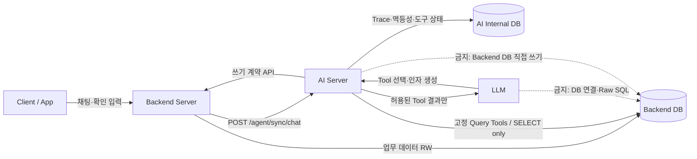
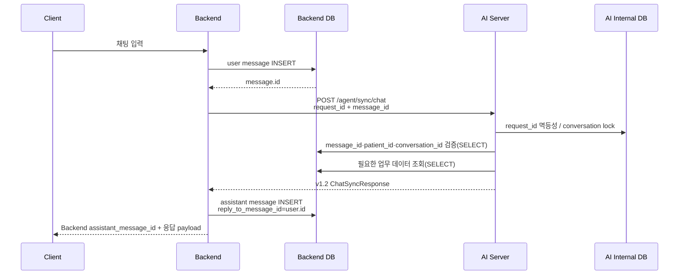

# Backend v1.2 테스트베드 구현 및 개발팀 요구사항

## 1. 목적과 현재 상태

이 문서는 AI Server 연동규격 v1.2를 실제 Backend 개발팀에 요구하기 전에 `system_app` 테스트베드에서 먼저 검증한 구현을 기준으로 한다.

테스트베드에 구현된 범위는 다음과 같다.

- Backend가 사용자 메시지를 DB에 먼저 저장하고 DB PK를 `message_id`로 AI Server에 전달
- AI Server `/agent/sync/chat` 동기 호출 및 동일 요청 재시도
- AI 응답을 별도 assistant 메시지로 Backend DB에 저장
- `text`, `selection_box`, `input_box`, 표 응답의 화면 표시 및 후속 입력
- AI Server의 Backend DB read-only Query Tools
- AI Server에서 Backend로 요청하는 레코드 변경·알림 정책 변경 API
- Backend DB PK와 분리된 알림 정책 공개 ID
- Backend 쓰기 API의 `request_id` 멱등성
- 변경 가능한 업무 레코드의 `expected_version` 낙관적 잠금
- AI Trace·도구 실행 상태와 Backend 업무 데이터의 저장소 분리

기존 `/agent/multiturn-chat` 및 Backend 소유 `mutation_confirmations` 흐름은 레거시 시나리오 회귀를 위해 남아 있다. 일반 채팅 화면은 `contract_version=v1.2`를 보내 새 경로를 사용한다.

## 2. 서비스 및 데이터 소유권



| 데이터 | 원장 소유자 | AI Server 권한 |
|---|---|---|
| 사용자·채팅·복약·영양·알림 정책 | Backend DB | 고정 Query Tool을 통한 SELECT |
| 레코드 생성·변경·삭제 | Backend Server | Backend 쓰기 API 호출만 가능 |
| 요청 멱등성·Trace·도구 실행·대기 작업 | AI Internal DB | 읽기·쓰기 |
| `trace_id` | AI Internal DB | 외부 계약에 노출하지 않음 |

## 3. 채팅 처리 순서



Backend 필수 규칙:

1. AI 호출 전에 사용자 메시지를 반드시 커밋한다.
2. AI 요청의 `message_id`는 방금 저장한 사용자 메시지의 Backend DB PK 문자열이다.
3. `request_id`는 Backend가 생성하며, timeout·503·504 재시도에도 본문과 함께 그대로 재사용한다.
4. AI 응답의 `message_id`는 사용자 메시지 ID의 echo이므로 assistant 메시지 ID로 사용하지 않는다.
5. assistant 메시지는 Backend가 별도로 저장하고 자체 DB PK를 Client에 반환한다.
6. 같은 `request_id`의 AI 응답을 재수신해도 assistant 메시지는 한 건만 저장한다.

테스트베드 Client 진입 API는 `POST /api/chat/sync`이다. 실제 Backend의 Client API 경로는 개발팀 표준을 따르되 위 처리 순서는 동일해야 한다.

## 4. Backend DB 요구 스키마

### 4.1 chat_messages

기존 필드 외에 다음 필드가 필요하다.

| 필드 | 용도 |
|---|---|
| `conversation_id` | 대화 단위 식별자 |
| `ai_request_id` | Backend가 AI 호출에 사용한 `request_id` |
| `message_type` | `text`, `selection_box`, `input_box` |
| `message_payload_json` | 규격의 구조화 `message` 객체 |
| `reply_to_message_id` | assistant가 답하는 user message PK |
| `processing_status` | `pending`, `completed`, `retryable_failed`, `final_failed` |

필수 제약:

- `(ai_request_id, role)`은 `ai_request_id`가 비어 있지 않을 때 유일해야 한다.
- `(conversation_id, id)` 조회 인덱스가 필요하다.
- assistant의 `reply_to_message_id`는 같은 환자·대화의 user message를 가리켜야 한다.

### 4.2 변경 가능한 업무 테이블

다음 레코드에 `version INTEGER NOT NULL DEFAULT 1`이 필요하다.

- `dose_events`
- `nutrition_meals`
- `nutrition_foods`
- `reminder_policies`

성공적인 update마다 `version = version + 1`로 변경한다. AI 요청의 `expected_version`과 현재 버전이 다르면 변경하지 않고 `VERSION_CONFLICT`를 반환한다.

`reminder_policies`에는 다음 공개 식별자를 추가한다.

| 필드 | 규칙 |
|---|---|
| `public_id` | 문자열, NOT NULL, UNIQUE, 외부 API와 AI Tool에서 사용하는 불투명 공개 ID |

- 예시: `npol_0123456789abcdef0123456789abcdef`
- 숫자형 `reminder_policies.id`는 Backend 내부 PK로만 사용하며 AI Server와 LLM에 노출하지 않는다.
- 기존 정책 row에는 배포 migration에서 충돌하지 않는 공개 ID를 backfill한다.
- 정책 조회 Query Tool과 정책 변경 API는 모두 동일한 `public_id`를 `policy_id`로 사용한다.

### 4.3 Backend 쓰기 멱등성 테이블

테스트베드는 `backend_api_requests`를 사용한다.

- 유일 범위: `(api_path, request_id)`
- 같은 ID + 같은 body + 완료: 저장된 HTTP status와 body 그대로 replay
- 같은 ID + 다른 body: `409 IDEMPOTENCY_CONFLICT`
- 같은 ID + 처리 중: `409 REQUEST_IN_PROGRESS`
- 업무 변경과 멱등성 완료 기록은 하나의 DB transaction으로 커밋

## 5. AI Server가 호출할 Backend 쓰기 API

AI가 쓰기 필요성을 판단하면 모델이 아래 쓰기 Tool을 호출한다. 모델은 대상과 변경값 같은 업무 인자만 생성한다. 각 Tool 내부의 Backend interaction point가 신뢰된 채팅 컨텍스트와 Read 전용 조회 결과로 기술 인자를 채운 뒤 해당 API를 호출하며, Agent의 같은 처리 turn에서 응답을 기다리는 동기 request-response 방식으로 실행한다. 별도 queue나 callback worker가 Backend 쓰기를 대신 실행하지 않는다.

현재 v1.2 동기 쓰기 Tool 목록:

| AI Tool | 모델 필수 인자 | Backend API | 외부 API `expected_version` |
|---|---|---|---|
| `update_medication_dose_event_status` | `dose_event_id` | `/agent/sync/record-change` | Tool이 조회·주입 |
| `create_nutrition_meal_record` | `meal_type`, `foods` | `/agent/sync/record-change` | 없음 |
| `update_nutrition_meal_record` | `meal_id` + 변경 필드 | `/agent/sync/record-change` | Tool이 조회·주입 |
| `delete_nutrition_meal_record` | `meal_id` | `/agent/sync/record-change` | Tool이 조회·주입 |
| `update_nutrition_food_record` | `meal_id`, `food_id` + 변경 필드 | `/agent/sync/record-change` | Tool이 조회·주입 |
| `delete_nutrition_food_record` | `meal_id`, `food_id` | `/agent/sync/record-change` | Tool이 조회·주입 |
| `change_notification_policy` | 공개 `policy_id`, `decision` + 선택적 `changes` | `/agent/sync/notification-policy-change` | Tool이 조회·주입 |

모델에 노출하지 않고 AI Server Tool이 관리하는 필드:

- `patient_id`: 검증된 현재 채팅 컨텍스트에서 주입
- `expected_version`: 대상 row를 Read 전용 Query Tool로 조회한 직후 주입
- `request_id`: 원본 채팅 요청·Tool 이름·Tool call ID·업무 인자를 정규화하여 생성
- `source_chat_request_id`, `conversation_id`, `confirmation_message_id`: Backend가 전달하고 AI Server가 검증한 채팅 컨텍스트에서 주입
- `requested_at`: 현재 요청 컨텍스트에서 주입
- `reason`: 사용자 메시지에서 명시적으로 확인된 Tool 실행이라는 표준 감사 사유를 주입

모든 v1.2 쓰기 Tool의 입력 JSON Schema는 최상위 및 정의된 중첩 객체에 `additionalProperties: false`를 사용한다. 따라서 모델이 위 기술 필드나 정의되지 않은 임의 필드를 추가하면 Backend 호출 전에 거절한다.

`request_id`는 `source_chat_request_id`, Tool 이름, Tool call ID 및 정규화된 인자 hash로 AI Server가 결정한다. 동일 Tool call을 재시도할 때 같은 `request_id`와 같은 body를 사용한다. 내부 `trace_id`는 Backend 계약으로 전달하지 않는다.

`confirmation_message_id`는 별도의 AI 내부 action ID가 아니라, 현재 Tool 실행을 발생시킨 Backend DB의 실제 사용자 메시지 ID를 사용한다. Backend는 해당 메시지와 환자·대화·원본 요청의 관계를 검증한다.

`create_medication_side_effect_record`, `upsert_nutrition_preference_fact`, `propose_system_policy`는 현재 v1.2 Backend 쓰기 계약이 지원하지 않으므로 위 목록에 포함하지 않는다. 필요할 경우 Backend 리소스와 payload 계약을 먼저 확장한다.

### 5.1 레코드 변경

- `POST /agent/sync/record-change`
- Bearer 인증 필수
- 지원 리소스:
  - `nutrition_meal`: create, update, delete
  - `nutrition_food`: update, delete
  - `medication_dose_event`: update(`taken`)만 지원

Backend는 다음을 검증해야 한다.

- `confirmation_message_id`가 Backend DB의 실제 user message PK인지
- 해당 메시지의 `patient_id`, `conversation_id`가 요청과 같은지
- `source_chat_request_id`가 같은 환자·대화의 실제 AI 채팅 요청인지
- update/delete의 `expected_version`이 현재 버전과 같은지
- `record_id`, `parent_record_id`의 소유 관계가 올바른지

### 5.2 알림 정책 변경

- `POST /agent/sync/notification-policy-change`
- Bearer 인증 필수
- `policy_id`는 숫자형 DB PK가 아니라 `reminder_policies.public_id`
- AI Server는 변경 전에 `get_notification_policies` Read Tool로 공개 ID와 현재 정책을 조회
- `decision=apply`: 검증 후 변경하고 version 증가
- `decision=keep`: 변경하지 않고 현재 version 반환
- `expected_version` 불일치 시 `409 VERSION_CONFLICT`

모델이 변경할 수 있는 `changes` 필드는 다음으로 제한한다.

| 필드 | 허용값 |
|---|---|
| `extra_reminders` | 0~5 |
| `interval_minutes` | 5~60 |
| `missed_dose_after_minutes` | 15~240 |
| `primary_reminder_timing` | `before`, `at`, `after` |
| `primary_reminder_offset_minutes` | 0~120, `at`이면 0 |
| `effective_start_date` | `YYYY-MM-DD`, 명시적으로 변경할 때 요청일보다 과거 금지 |
| `effective_end_date` | `YYYY-MM-DD`, 시작일 이상, 전체 기간 최대 365일 |

`policy_key`, `slot_label`, 알림 문구 template, `source`, `active`, `version`은 모델 변경 대상이 아니다. Backend는 부분 변경값을 현재 정책과 합친 뒤 정책별 경계와 “마지막 추가 알림 시각 ≤ 미복용 판단 시각” 교차 규칙을 재검증한다. 위반 시 `422 POLICY_BOUNDARY_VIOLATION` 또는 구체적인 날짜 오류 코드를 반환한다.

### 5.3 오류 응답

모든 오류는 HTTP status와 함께 규격의 다음 구조를 반환한다.

```json
{
  "success": false,
  "request_id": "동일 요청 ID",
  "result": null,
  "error": {
    "code": "VERSION_CONFLICT",
    "message": "VERSION_CONFLICT",
    "retryable": false,
    "details": {
      "expected_version": 1,
      "current_version": 2
    }
  },
  "processed_at": "2026-07-25T15:00:00+09:00"
}
```

권장 HTTP status:

| 상황 | status |
|---|---:|
| 성공·완료 replay | 200 |
| 리소스 없음 | 404 |
| 멱등성·version·확인 메시지 충돌 | 409 |
| 계약 또는 업무 검증 실패 | 422 |
| 일시적 DB·Backend 장애 | 503 또는 504 |
| 예기치 않은 서버 오류 | 500 |

## 6. Backend DB read-only 접근 요구

Backend 개발팀은 AI Server 전용 DB 계정을 제공해야 한다.

- 허용: 승인된 테이블·view의 `SELECT`
- 금지: `INSERT`, `UPDATE`, `DELETE`, DDL, procedure 실행
- Backend writer 계정과 자격 증명을 공유하지 않음
- 가능하면 AI용 view로 노출 컬럼과 환자 범위를 제한
- 접속 정보는 AI Server secret으로 전달
- 연결 실패와 slow query를 Backend·AI 양쪽에서 관측 가능하게 구성

AI Server Query Tool은 정해진 함수와 parameterized query만 사용한다. LLM이 SQL 문자열, 테이블명, DB 자격 증명, DB session을 생성하거나 전달할 수 없어야 한다.

테스트베드 SQLite에서는 다음 설정으로 쓰기 차단을 검증한다.

```text
PRAGMA query_only = ON
```

운영 PostgreSQL에서는 DB role의 SELECT-only 권한이 최종 통제이며 AI 연결 session도 read-only로 설정한다.

## 7. 인증과 환경 설정

| 방향 | 인증 | 설정 |
|---|---|---|
| Backend → AI `/agent/sync/chat` | Bearer | 양쪽 `AGENT_SYNC_API_TOKEN` 동일 |
| AI → Backend 쓰기 API | Bearer | 양쪽 `BACKEND_API_TOKEN` 동일 |
| AI → Backend DB 조회 | DB SELECT-only 계정 | AI `BACKEND_READ_DATABASE_URL` |

테스트베드 주요 설정:

```dotenv
BACKEND_READ_DATABASE_URL=sqlite:///./data/system.db
BACKEND_QUERY_MAX_ROWS=100
BACKEND_RECORD_CHANGE_PATH=/agent/sync/record-change
BACKEND_NOTIFICATION_POLICY_CHANGE_PATH=/agent/sync/notification-policy-change
AGENT_SYNC_API_TOKEN=replace-with-shared-secret
AGENT_SYNC_MAX_RETRIES=2
BACKEND_API_TOKEN=replace-with-different-shared-secret
```

운영 환경에서는 두 토큰을 서로 다른 값으로 사용하고 secret manager를 통해 주입한다.

## 8. Backend 개발팀 인수 테스트

개발팀 전달 전후에 최소한 다음을 통과해야 한다.

1. user message가 커밋되기 전에 AI 호출이 발생하지 않는다.
2. AI가 받은 `message_id`로 Backend DB user message를 조회할 수 있다.
3. 완료된 AI 요청을 동일 `request_id`로 재전송하면 Agent가 재실행되지 않고 같은 응답이 반환된다.
4. 같은 `request_id`에 다른 body를 보내면 409가 반환된다.
5. 같은 AI 응답을 Backend가 두 번 받아도 assistant 메시지는 한 건이다.
6. `expected_version`이 오래된 update는 업무 데이터를 바꾸지 않는다.
7. 확인 메시지 PK·환자·대화가 일치하지 않으면 쓰기가 거절된다.
8. AI DB 장애가 Backend 업무 원장을 손상시키지 않는다.
9. AI DB 계정으로 Backend DB 쓰기를 시도하면 DB 수준에서 거절된다.
10. 외부 요청·응답과 Backend 업무 테이블에 AI 내부 `trace_id`가 저장되지 않는다.
11. `selection_box` 버튼 입력이 같은 conversation의 새 user message로 저장된다.
12. `input_box` 입력이 JSON 객체 문자열로 저장·전달된다.
13. 정책 조회 결과와 정책 변경 응답의 `policy_id`가 동일한 공개 ID이며 숫자형 DB PK가 노출되지 않는다.
14. 모델이 `patient_id`, `expected_version`, `reason` 또는 정의되지 않은 추가 속성을 쓰기 Tool 인자로 전달하면 Backend 호출 전에 거절된다.
15. 정책별 경계나 교차 규칙을 위반한 변경은 version과 정책 데이터를 바꾸지 않는다.

## 9. 테스트베드 검증 결과

2026-07-25 기준:

- 전체 자동화 테스트: `441 passed, 3 skipped`
- 신규 v1.2 테스트:
  - 메시지 선저장과 별도 assistant ID
  - 동일 채팅 요청 replay
  - 확인 메시지 검증
  - version 증가와 충돌
  - Backend 쓰기 멱등성
  - SQLite Query Tool 쓰기 차단
  - 공개 `policy_id` 생성·조회·변경
  - Tool 내부 `expected_version` 조회·주입
  - 기술 인자 및 정의되지 않은 추가 속성 차단
  - 알림 정책 범위·교차 규칙 검증
  - 화면 input box JSON 변환과 동일 conversation 유지
- 실제 `data/system.db` migration:
  - schema migration 총 32개
  - `reminder_policies.public_id` 컬럼 및 UNIQUE index 추가
  - 현재 정책 row 0건, 공개 ID 누락·중복 0건
  - `PRAGMA integrity_check = ok`
  - journal mode `wal`

공개 정책 ID migration 전 일관된 스냅샷:

`data/backups/system-before-policy-public-id-20260725.db`
