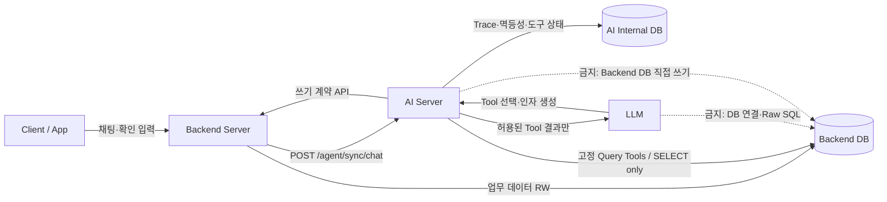
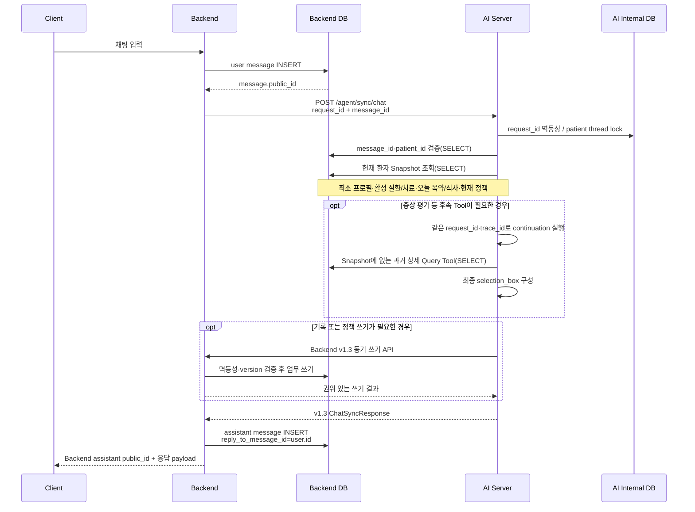

# Backend v1.3 테스트베드 구현 및 개발팀 요구사항

## 1. 목적과 현재 상태

이 문서는 AI Server 연동규격 v1.3을 실제 Backend 개발팀에 요구하기 전에 `system_app` 테스트베드에서 먼저 검증한 구현을 기준으로 한다.

테스트베드에 구현된 범위는 다음과 같다.

- Backend가 사용자 메시지를 DB에 먼저 저장하고 불투명 공개 ID를 `message_id`로 AI Server에 전달
- AI Server `/agent/sync/chat` 동기 호출 및 동일 요청 재시도
- AI 응답을 별도 assistant 메시지로 Backend DB에 저장
- `text`, `selection_box`, `input_box`, 표 응답의 화면 표시 및 후속 입력
- AI Server의 Backend DB Read-only 현재 환자 Snapshot과 상세 Query Tools
- AI 답변 공개 ID를 검증하는 비동기 피드백 접수 및 암호화 저장
- AI Server에서 Backend로 요청하는 레코드 변경·알림 정책 변경 API
- Backend 내부 PK와 분리된 채팅·복약·영양·알림 정책 공개 ID
- Backend 쓰기 API의 `request_id` 멱등성
- 변경 가능한 업무 레코드의 `expected_version` 낙관적 잠금
- AI Trace·도구 실행 상태와 Backend 업무 데이터의 저장소 분리

일반 채팅 화면은 `contract_version=v1.3`과 `/agent/sync/chat`만 사용한다.
원시 `/agent/multiturn-chat` 및 `/agent/mutation-confirmations/resolve` 경로는
제거했으며, v1.3 쓰기 Tool은 같은 동기 요청 안에서 Backend 쓰기 계약 API를
호출한다.

## 2. 서비스 및 데이터 소유권



| 데이터 | 원장 소유자 | AI Server 권한 |
|---|---|---|
| 사용자·채팅·복약·영양·알림 정책 | Backend DB | 고정 Query Tool을 통한 SELECT |
| 레코드 생성·변경·삭제 | Backend Server | Backend 쓰기 API 호출만 가능 |
| 요청 멱등성·Trace·도구 실행·대기 작업 | AI Internal DB | 읽기·쓰기 |
| `trace_id` | AI Internal DB | 외부 계약에 노출하지 않음 |

AI Internal DB는 동기·비동기·실패 Trace, Step, Tool 실행, token usage와 비용
기록의 단일 원장이다. 해당 관측 데이터는 원문 의료정보 대신 hash/redaction을
저장하고 생성 시점부터 3년 뒤 삭제한다. Backend는 메시지·업무 상태·Agent
job·callback receipt·최소 API 감사만 보관하며 Trace/Step을 중복 저장하지 않는다.

Backend DB는 이 연동에서 PHR 원천을 포함한 환자정보 원장이다. 활성 v1.3
채팅은 별도 PHR 서비스 등록이나 `phr_patient_key` 발급을 선행조건으로 두지
않는다. 저장소에 남은 호환 모듈과 설정의 제거 여부는 별도 정리 작업으로
검증한다.

## 3. 채팅 처리 순서



Backend 필수 규칙:

1. AI 호출 전에 사용자 메시지를 반드시 커밋한다.
2. AI 요청의 `message_id`는 방금 저장한 사용자 메시지의 `chat_messages.public_id`이다.
3. `request_id`는 Backend가 생성하며, timeout·503·504 재시도에도 본문과 함께 그대로 재사용한다.
4. AI 응답의 `message_id`는 사용자 메시지 ID의 echo이므로 assistant 메시지 ID로 사용하지 않는다.
5. assistant 메시지는 Backend가 별도로 저장하고 `chat_messages.public_id`를 Client에 반환한다.
6. 같은 `request_id`의 AI 응답을 재수신해도 assistant 메시지는 한 건만 저장한다.

AI Server 내부 첫 실행에서 `continuation_required=true`를 판단하더라도
`/agent/sync/chat`에서는 그 임시 안내를 성공 응답으로 반환하지 않는다. 최초 실행과
후속 Tool 실행은 동일한 `request_id`, 내부 `trace_id`, 전체 동기 timeout 안에서
완료한다. 허용된 continuation 횟수를 넘기거나 최종 구조화 결과를 만들지 못하면
성공 텍스트로 대체하지 않고 오류로 종료한다.

PRO-CTCAE 조회가 성공하면 Tool 결과의 첫 문항과 응답 선택지를 v1.3
`selection_box`로 반환한다. 화면 안내문과 실제 첫 문항은 `message.text`에 함께
포함하고, 선택지는 `message.selections`에 담는다. 이 구조화 응답은 LLM이 임의로
만든 fallback 문항이 아니라 `get_pro_ctcae_questionnaire` Tool 결과에서만
생성한다.

테스트베드 React Client 진입 API는 `POST /api/ui/v1/chat/sync`이다. Backend가
인증된 사용자 컨텍스트의 `patient_id`를 주입한 뒤
`POST /agent/sync/chat`을 호출한다. 실제 Backend의 Client API 경로는 개발팀
표준을 따르되 위 신뢰 경계와 처리 순서는 동일해야 한다.

## 4. Backend DB 요구 스키마

### 4.1 chat_messages

기존 필드 외에 다음 필드가 필요하다.

| 필드 | 용도 |
|---|---|
| `public_id` | `user_msg_*`, `assistant_msg_*` 형식의 불투명 공개 ID. NOT NULL, UNIQUE |
| `ai_request_id` | Backend가 AI 호출에 사용한 `request_id` |
| `message_type` | `text`, `selection_box`, `input_box` |
| `message_payload_json` | 규격의 구조화 `message` 객체 |
| `reply_to_message_id` | assistant가 답하는 user message PK |
| `processing_status` | `pending`, `completed`, `retryable_failed`, `final_failed` |

필수 제약:

- `(ai_request_id, role)`은 `ai_request_id`가 비어 있지 않을 때 유일해야 한다.
- `(patient_id, created_at, id)` 조회 인덱스가 필요하다.
- assistant의 `reply_to_message_id`는 같은 환자의 user message를 가리켜야 한다.

### 4.2 변경 가능한 업무 테이블

다음 레코드에 `version INTEGER NOT NULL DEFAULT 1`이 필요하다.

- `dose_events`
- `nutrition_meals`
- `nutrition_foods`
- `reminder_policies`

성공적인 update마다 `version = version + 1`로 변경한다. AI 요청의 `expected_version`과 현재 버전이 다르면 변경하지 않고 `VERSION_CONFLICT`를 반환한다.

외부 계약에서 식별되는 다음 테이블에는 내부 숫자 PK와 별도의 공개 식별자를 추가한다.

| 테이블 | 공개 ID 예시 |
|---|---|
| `chat_messages` | `user_msg_100`, `assistant_msg_200` |
| `dose_events` | `dose_120` |
| `nutrition_meals` | `meal_42` |
| `nutrition_foods` | `food_51` |
| `reminder_policies` | `npol_0123456789abcdef0123456789abcdef` |

- 모든 `public_id`는 문자열, NOT NULL, UNIQUE이며 외부 API와 AI Tool에서 사용하는 불투명 ID이다.
- 숫자형 PK는 Backend 내부 FK·정렬·처리에만 사용하며 AI Server 응답과 LLM에 노출하지 않는다.
- 기존 row에는 배포 migration에서 충돌하지 않는 공개 ID를 backfill한다.
- 전환 기간에는 기존 숫자 ID의 문자열 입력을 안전하게 조회할 수 있지만 응답은 항상 공개 ID를 반환한다.
- 정책 조회 Query Tool과 정책 변경 API는 모두 동일한 `public_id`를 `policy_id`로 사용한다.

### 4.3 Backend 쓰기 멱등성 테이블

테스트베드는 `backend_api_requests`를 사용한다.

- 유일 범위: `(api_path, request_id)`
- 같은 ID + 같은 body + 완료: 저장된 HTTP status와 body 그대로 replay
- 같은 ID + 다른 body: `409 IDEMPOTENCY_CONFLICT`
- 같은 ID + 처리 중: `409 REQUEST_IN_PROGRESS`
- 업무 변경과 멱등성 완료 기록은 하나의 DB transaction으로 커밋

## 5. AI Server가 호출할 Backend 쓰기 API

AI가 쓰기 필요성을 판단하면 모델은 쓰기 Tool을 직접 실행하지 않고 먼저
`request_record_approval`을 호출한다. 이 Tool은 대상 쓰기 Tool 이름과 업무
인자를 고정한 승인 카드를 만들 뿐 데이터를 변경하지 않는다. 사용자가 해당
카드의 기록·수정·삭제 동작을 선택하면 AI Server가 Agent DB의 승인 상태를
검증하고 짧은 일회용 `approval_key`를 발급한다. Agent 실행 경계에는 이 키만
주입되며, Tool은 Agent DB에서 암호화해 보관한 원래 업무 인자를 복원한 뒤 아래
Backend API를 호출한다. 각 Tool은 Agent의 같은 처리 turn에서 Backend 응답을
기다리는 동기 request-response 방식이며 별도 queue나 callback worker가 쓰기를
대신 실행하지 않는다.

현재 v1.3 동기 쓰기 Tool 목록:

| AI Tool | 모델 필수 인자 | Backend API | 외부 API `expected_version` |
|---|---|---|---|
| `update_medication_dose_event_status` | `dose_event_id` | `/agent/sync/record-change` | 승인 당시 version 주입 |
| `create_nutrition_meal_record` | `meal_type`, `foods` | `/agent/sync/record-change` | 없음 |
| `update_nutrition_meal_record` | `meal_id` + 변경 필드 | `/agent/sync/record-change` | 승인 당시 version 주입 |
| `delete_nutrition_meal_record` | `meal_id` | `/agent/sync/record-change` | 승인 당시 version 주입 |
| `update_nutrition_food_record` | `meal_id`, `food_id` + 변경 필드 | `/agent/sync/record-change` | 승인 당시 version 주입 |
| `delete_nutrition_food_record` | `meal_id`, `food_id` | `/agent/sync/record-change` | 승인 당시 version 주입 |
| `create_medication_side_effect_record` | `symptom_text` + 선택적 증상 시점·약 이름 | `/agent/sync/record-change` | 없음(create) |
| `change_notification_policy` | 공개 `policy_id`, `decision` + 선택적 `changes` | `/agent/sync/notification-policy-change` | Tool이 조회·주입 |

`dose_event_id`, `meal_id`, `food_id`, `policy_id`는 모두 공개 opaque 문자열이다.

모델에 노출하지 않고 AI Server Tool이 관리하는 필드:

- `patient_id`: 검증된 현재 채팅 컨텍스트에서 주입
- `expected_version`: 승인 카드 생성 당시 target snapshot의 version을 주입
- `request_id`: 승인된 원본 요청·Tool·업무 인자에서 AI Server가 결정적으로 생성
- `source_chat_request_id`, `confirmation_message_id`: Backend가 전달하고 AI Server가 검증한 채팅 컨텍스트에서 주입
- `approval_key`: 사용자 선택 뒤 AI Server가 발급하며 모델·AI 응답·로그·Backend 요청에는 노출하지 않음
- `requested_at`: 현재 요청 컨텍스트에서 주입
- `reason`: 사용자 메시지에서 명시적으로 확인된 Tool 실행이라는 표준 감사 사유를 주입

모든 v1.3 쓰기 Tool의 입력 JSON Schema는 최상위 및 정의된 중첩 객체에 `additionalProperties: false`를 사용한다. 따라서 모델이 위 기술 필드나 정의되지 않은 임의 필드를 추가하면 Backend 호출 전에 거절한다.

Backend 개발팀 전달용 기계 판독 계약은 `docs/BACKEND_V13_WRITE_OPENAPI.json`이다. `python tools/export_backend_v13_openapi.py`로 현재 FastAPI 모델에서 다시 생성할 수 있으며 자동화 테스트가 저장된 파일과 실제 스키마의 일치를 검증한다.

동일 승인 쓰기를 재시도할 때 같은 `request_id`, `approval_key`, body를 사용한다.
Backend가 응답을 확정하면 AI Server는 키를 `consumed`로 전환한다. 전송 장애처럼
재시도 가능한 실패에서는 같은 키를 다시 사용할 수 있지만 다른 환자·메시지·
Tool·업무 인자에는 사용할 수 없다.
내부 `trace_id`는 Backend 계약으로 전달하지 않는다.

`confirmation_message_id`는 별도의 AI 내부 action ID가 아니라, 현재 Tool 실행을 발생시킨 Backend DB 사용자 메시지의 `public_id`를 사용한다. Backend는 해당 메시지와 환자·대화·원본 요청의 관계를 검증한다.
Backend는 승인 키를 발급하거나 승인 상태를 저장하지 않으며,
`mutation_confirmations` 테이블과 `/api/agent/mutation-confirmations/prepare`
확장 API는 사용하지 않는다.

`create_medication_side_effect_record`는 `medication_side_effect_record:create`로
지원한다. 모델은 사용자 표현만 생성하며 AI Server가 신뢰된 Snapshot으로 약 후보,
평가 결과, 관련 복약 이벤트와 저장 draft를 다시 계산한다.
`upsert_nutrition_preference_fact`도 `request_record_approval`을 거치지만 현재
v1.3 `/agent/sync/record-change` 리소스에는 포함되지 않아 기존 내부
confirmation 실행 경로를 사용한다. `propose_system_policy`는 별도 정책 승인
경계로 유지한다.

### 5.1 레코드 변경

- `POST /agent/sync/record-change`
- Bearer 인증 필수
- 지원 리소스:
  - `nutrition_meal`: create, update, delete
  - `nutrition_food`: update, delete
  - `medication_dose_event`: update(`taken`)만 지원
  - `medication_side_effect_record`: create

Backend는 다음을 검증해야 한다.

- `confirmation_message_id`가 Backend DB의 실제 user message 공개 ID인지
- 해당 메시지의 `patient_id`가 요청과 같은지
- `source_chat_request_id`가 같은 환자의 실제 AI 채팅 요청인지
- `approval_key`가 해당 사용자 승인 메시지, action, `request_id`에 결합된
  미사용·미만료 capability인지
- update/delete의 `expected_version`이 현재 버전과 같은지
- `record_id`, `parent_record_id`의 소유 관계가 올바른지

### 5.2 알림 정책 변경

- `POST /agent/sync/notification-policy-change`
- Bearer 인증 필수
- `policy_id`는 숫자형 DB PK가 아니라 `reminder_policies.public_id`
- 알림 정책 create API와 AI Tool은 제공하지 않는다. AI Server는 기존 활성 정책만 변경할 수 있다.
- AI Server는 변경 전에 `get_notification_policies(active_only=true)` Read Tool로 공개 ID와 현재 정책을 조회한다.
- 조회 결과가 0건이면 승인 카드를 만들거나 신규 정책 생성을 제안하지 않고 fail-closed 처리한다.
- 승인 카드 생성 직전과 Backend 실제 쓰기 시점에 같은 환자의 `active=true` 정책인지 다시 검증한다.
- `decision=apply`: 검증 후 변경하고 version 증가
- `decision=keep`: 변경하지 않고 현재 version 반환
- `expected_version` 불일치 시 `409 VERSION_CONFLICT`

테스트베드는 복약 시나리오를 적용할 때 Backend 시나리오 준비 단계에서 슬롯별
기본 활성 정책을 멱등 생성한다. 이는 AI 기능이 아니다. 실제 Backend는 환자 등록·
복약 일정 온보딩 등 자체 업무 절차에서 정책을 준비해야 하며, AI Server를 연결할
때는 `get_notification_policies`의 Read View와 위 변경 API만 같은 계약으로 제공한다.

모델이 변경할 수 있는 `changes` 필드는 다음으로 제한한다.

| 필드 | 허용값 |
|---|---|
| `extra_reminders` | 0~5 |
| `interval_minutes` | 5~60 |
| `missed_dose_after_minutes` | 15~240 |
| `primary_reminder_timing` | `before`, `at`, `after` |
| `primary_reminder_offset_minutes` | 0~120, `at`이면 0 |
| `effective_start_date` | `YYYY-MM-DD`, 명시적으로 변경할 때 요청일보다 과거 금지 |
| `effective_end_date` | `YYYY-MM-DD`, 시작일 이상, 전체 기간 최대 365일 |

`policy_key`, `slot_label`, 알림 문구 template, `source`, `active`, `version`은 모델 변경 대상이 아니다. Backend는 부분 변경값을 현재 정책과 합친 뒤 정책별 경계와 “마지막 추가 알림 시각 ≤ 미복용 판단 시각” 교차 규칙을 재검증한다. 위반 시 `422 POLICY_BOUNDARY_VIOLATION` 또는 구체적인 날짜 오류 코드를 반환한다.

### 5.3 오류 응답

모든 오류는 HTTP status와 함께 규격의 다음 구조를 반환한다.

Bearer 인증 실패와 Pydantic Request schema 검증 실패도 FastAPI 기본 `detail` 응답을 사용하지 않고 동일한 `success/result/error/processed_at` 계약을 반환한다. 스키마 검증 실패의 `request_id`는 유효한 본문에 포함된 값을 유지하며 오류 코드는 `INVALID_REQUEST`이다.

```json
{
  "success": false,
  "request_id": "동일 요청 ID",
  "result": null,
  "error": {
    "code": "VERSION_CONFLICT",
    "message": "VERSION_CONFLICT",
    "retryable": false,
    "details": {
      "expected_version": 1,
      "current_version": 2
    }
  },
  "processed_at": "2026-07-25T15:00:00+09:00"
}
```

권장 HTTP status:

| 상황 | status |
|---|---:|
| 성공·완료 replay | 200 |
| 리소스 없음 | 404 |
| 멱등성·version·확인 메시지 충돌 | 409 |
| 계약 또는 업무 검증 실패 | 422 |
| 일시적 DB·Backend 장애 | 503 또는 504 |
| 예기치 않은 서버 오류 | 500 |

## 6. Backend DB read-only 접근 요구

Backend 개발팀은 AI Server 전용 DB 계정을 제공해야 한다.

- 허용: 계약에 선언된 `ai_v13_*` view의 `SELECT`
- 금지: `INSERT`, `UPDATE`, `DELETE`, DDL, procedure 실행
- 금지: Backend base table 직접 `SELECT`
- Backend writer 계정과 자격 증명을 공유하지 않음
- AI용 view로 노출 컬럼과 환자 범위를 제한
- 접속 정보는 AI Server secret으로 전달
- 연결 실패와 slow query를 Backend·AI 양쪽에서 관측 가능하게 구성

AI Server Query Tool은 정해진 함수와 parameterized query만 사용한다. LLM이 SQL 문자열, 테이블명, DB 자격 증명, DB session을 생성하거나 전달할 수 없어야 한다.

공개 ID 조회는 각 `ai_v13_*` View가 노출하는 불투명 공개 ID 열을 대상으로
AI Server 소유의 고정 parameterized query로 수행한다. Backend 숫자 PK나 내부
행 순서는 Tool 응답 및 모델 컨텍스트에 노출하지 않는다.

테스트베드도 PostgreSQL database와 role을 분리한다.

| 실행 주체 | 자체 DB role | 타 서비스 DB 접근 |
|---|---|---|
| Backend `system-app` | `dranswer_system`의 runtime RW role | 없음 |
| AI `agent-app`, `agent-worker` | `dranswer_agent`의 runtime RW role | `dranswer_system`의 `ai_backend_reader` |
| migration job | 각 DB의 전용 DDL role | 배포 시에만 접근 |

Agent 프로세스에 Backend 파일/volume을 mount하지 않는다.
`ai_backend_reader`에는 `default_transaction_read_only=on`을 적용하고 승인된
`ai_v13_*` View SELECT만 허용한다. 개발용 Compose도 프로젝트
루트 전체를 `/app`에 mount하지 않고 서비스별 소스 디렉터리만 read-only로 mount한다.
`./data` RW bind는 Backend 테스트베드의 운영·정책 artifact용으로 `system-app`만
가진다. 활성 경로의 기동 순서는 Backend migration/health → AI API → AI worker로
고정해, AI의 read-contract View 검증이 Backend migration보다 먼저 실행되는
race를 막는다. 활성 Compose에는 별도 `phr-app`이나 `phr-runtime`이 없으며
Snapshot 준비와 채팅 readiness는 Backend DB 승인 View만 사용한다.

모든 환경에서 DB role의 SELECT-only 권한이 최종 통제이며 AI 연결 session도
read-only로 설정한다.

## 7. 인증과 환경 설정

| 방향 | 인증 | 설정 |
|---|---|---|
| Backend → AI `/agent/sync/chat` | Bearer | 양쪽 `AGENT_SYNC_API_TOKEN` 동일 |
| Backend → AI `/agent/async/chat_feedback` | Bearer | 양쪽 `AGENT_SYNC_API_TOKEN` 동일 |
| AI → Backend 쓰기 API | Bearer | 양쪽 `AGENT_SYNC_API_TOKEN` 동일 |
| AI → Backend DB 조회 | DB SELECT-only 계정 | AI `BACKEND_READ_DATABASE_URL` |

테스트베드 주요 설정:

```dotenv
APP_ENV=testbed
SYSTEM_DATABASE_URL=postgresql+psycopg://system_app_rw@127.0.0.1:55432/dranswer_system
SYSTEM_MIGRATION_DATABASE_URL=postgresql+psycopg://system_migrator@127.0.0.1:55432/dranswer_system
SYSTEM_STARTUP_MIGRATIONS_ENABLED=false
AGENT_DATABASE_URL=postgresql+psycopg://agent_app_rw@127.0.0.1:55432/dranswer_agent
AGENT_MIGRATION_DATABASE_URL=postgresql+psycopg://agent_migrator@127.0.0.1:55432/dranswer_agent
AGENT_STARTUP_MIGRATIONS_ENABLED=false
BACKEND_READ_DATABASE_URL=postgresql+psycopg://ai_backend_reader@127.0.0.1:55432/dranswer_system
BACKEND_QUERY_MAX_ROWS=100
BACKEND_RECORD_CHANGE_PATH=/agent/sync/record-change
BACKEND_NOTIFICATION_POLICY_CHANGE_PATH=/agent/sync/notification-policy-change
AGENT_SYNC_API_TOKEN=replace-with-shared-secret
AGENT_SYNC_MAX_RETRIES=2
AGENT_FEEDBACK_ENCRYPTION_KEY=replace-with-urlsafe-base64-encoded-32-byte-key
AGENT_FEEDBACK_ENCRYPTION_KEY_ID=feedback-v1
LLM_PROVIDER=bedrock_anthropic
```

`deterministic_test` provider는 격리된 자동 테스트에서 명시적으로 선택할 때만
`APP_ENV=test|testing|testbed`에서 허용한다. 9000 기본 실행과 사용자 화면에는
사용하지 않는다. Backend↔AI 업무 통신은 `AGENT_SYNC_API_TOKEN` 하나를
양방향으로 사용한다. 권한 범위가 더 넓은 `INTERNAL_API_TOKEN`은 이 토큰과
다르게 두고 secret manager를 통해 주입하며, 승인된 외부 생성형 모델
provider를 사용한다.

## 8. Backend 개발팀 인수 테스트

개발팀 전달 전후에 최소한 다음을 통과해야 한다.

1. user message가 커밋되기 전에 AI 호출이 발생하지 않는다.
2. AI가 받은 `message_id`로 Backend DB user message를 조회할 수 있다.
3. 완료된 AI 요청을 동일 `request_id`로 재전송하면 Agent가 재실행되지 않고 같은 응답이 반환된다.
4. 같은 `request_id`에 다른 body를 보내면 409가 반환된다.
5. 같은 AI 응답을 Backend가 두 번 받아도 assistant 메시지는 한 건이다.
6. `expected_version`이 오래된 update는 업무 데이터를 바꾸지 않는다.
7. 확인 메시지 공개 ID·환자·대화가 일치하지 않으면 쓰기가 거절된다.
8. AI DB 장애가 Backend 업무 원장을 손상시키지 않는다.
9. AI DB 계정으로 Backend DB 쓰기를 시도하면 DB 수준에서 거절된다.
10. 외부 요청·응답과 Backend 업무 테이블에 AI 내부 `trace_id`가 저장되지 않는다.
11. `selection_box` 버튼 입력이 같은 conversation의 새 user message로 저장된다.
12. `input_box` 입력이 JSON 객체 문자열로 저장·전달된다.
13. 정책 조회 결과와 정책 변경 응답의 `policy_id`가 동일한 공개 ID이며 숫자형 DB PK가 노출되지 않는다.
14. 모델이 `patient_id`, `expected_version`, `reason` 또는 정의되지 않은 추가 속성을 쓰기 Tool 인자로 전달하면 Backend 호출 전에 거절된다.
15. 정책별 경계나 교차 규칙을 위반한 변경은 version과 정책 데이터를 바꾸지 않는다.
16. OpenAPI에 `BackendApiBearer` security scheme과 401·404·409·422·500·503·504 계약 응답이 선언된다.
17. 인증 실패와 Request schema 검증 실패도 공통 오류 응답 구조를 유지한다.
18. AI 컨테이너에는 Backend 저장소 mount가 없고 PostgreSQL reader role의
    base table 조회·DML·DDL probe가 거절된다.
19. Backend 업무 DB와 AI Internal DB의 URL·RW volume이 분리되며, AI의
    Backend DB 연결은 Read-only이다.
20. 저장된 Backend v1.3 OpenAPI와 현재 코드에서 생성한 OpenAPI가 일치한다.
21. AI 채팅 OpenAPI는 실제 400 변환 동작과 일치하며 401·404·409·500·503·504를 선언한다.
22. AI DB 조회 계정은 `ai_v13_*` view만 SELECT할 수 있고 raw Backend table과 모든 쓰기가 거절된다.
23. AI Server 재시작·동시 실행·LLM `tool_call_id` 재생성 후에도 최초 canonical `request_id`와 `expected_version`을 재사용한다.
24. terminal Backend 응답은 늦은 retryable 응답이나 transport 실패로 덮어쓸 수 없다.
25. `system_app`은 `agent_app` 런타임을 import하지 않고 양쪽 공용 계약은 `shared`에서만 소유한다.
26. message·dose event·meal·food 조회 및 쓰기 응답은 공개 ID만 반환하며 숫자 문자열 입력은 전환 호환으로만 처리된다.
27. 대기 중인 구조화 응답과 다른 `requested_return_type`, 잘못된 선택지·입력 필드, 중복·오래된 응답은 거절된다.
28. `tables`, `selection_box`, 숫자·dropdown `input_box`가 Backend 저장과 화면 왕복 과정에서 유실되지 않는다.
29. 유효한 AI 답변 피드백은 내부 Agent API에서 `202`와 `status`,
    `reaction`, timezone-aware `accepted_at`을 반환하고 동일 본문은 중복
    저장 없이 최초 응답 그대로 replay된다.
30. 같은 피드백 `request_id`에 다른 `reaction` 또는 `feedback_text`를 보내면
    `409 IDEMPOTENCY_CONFLICT`이며 user 메시지나 다른 환자·대화의
    메시지는 의견 대상으로 인정하지 않는다.
31. `reaction`(`like|dislike`)과 `feedback_text`(1~4,000자) 중 하나 이상이
    필수다. 반응은 답변별 상호배타 최신 상태이며, 자유 의견은
    AES-256-GCM 암호문으로만 AI DB에 저장된다. 키 누락·오류 시 Agent
    startup과 readiness가 fail-closed 된다.
32. 브라우저는 `POST /api/ui/v1/chat/feedback`에
    `request_id`, `assistant_message_id`, `feedback_at`과 선택적 `reaction`,
    `opinion_text`만 전송한다. Backend가 DB에서 환자 범위를 주입하며 Agent
    Bearer token과 `patient_id`는 브라우저에 노출하지 않는다.
33. Agent `202` 이후 Backend assistant 메시지에는 현재 반응과 수락 순서,
    의견 제출 여부·시각·요청 ID만 저장한다. 의견 평문은 Backend DB에
    저장하지 않으며 대화 이력 DTO는 `reaction`, `opinion_submitted`,
    `opinion_submitted_at`을 노출한다. 의견 전용 요청은 반응을 덮지 않고,
    과거 replay의 `accepted_at`은 더 최신인 반응을 되돌리지 않는다.
34. 채팅 시작 시 최소 프로필, 활성 질환·치료, 오늘 복약 시간표·이력,
    오늘 식사, 현재 유효 알림 정책을 Backend DB Read-only Snapshot으로
    구성하고 각 도메인의 availability를 구분한다.
35. 부작용 평가 Tool은 같은 요청의 trusted Snapshot을 재사용하며 별도
    PHR 등록, `phr_patient_key`, PHR HTTP 호출을 요구하지 않는다.
36. 과거 복약·전체 부작용·과거 식사는 범위가 제한된 상세 Read Tool로만
    조회하고, 모델이 `patient_id`나 Raw SQL을 전달할 수 없다.
37. 부작용 평가 기록을 포함한 업무 쓰기는 AI Internal DB나 별도 PHR DB가
    아니라 Backend 동기 쓰기 API를 거쳐 Backend DB에 저장된다.

자동화 명령:

```powershell
# Compose/9000 경계와 저장된 OpenAPI drift를 함께 검사
python tools/verify_testbed_contract.py

# 실행 중인 9000 stack에서 DB 경계와 실제 Backend→AI HTTP 흐름까지 검사
python tools/verify_testbed_contract.py --runtime

# Compose 문법과 merge 결과 검사
docker compose -f docker-compose.yml -f docker-compose.dev.yml config --quiet
```

`tools/da_drug_9000_stack.ps1 verify`는 health/worker 점검 후 위 runtime 검사를
실행하고 `outputs/runtime/9000/verify.json`의 `boundary_contract`에 증거를 남긴다.
컨테이너 readiness `/health/ready`는 DB·read contract·양방향 인증 설정과 생성형
provider 구성을 비용 없이 검사한다. 9000 전체 검증과 React의 AI 정상 표시는
Backend가 Bearer 인증으로 `/health/generation/ready`를 호출해 실제 최소 모델
생성까지 성공한 경우에만 통과한다. 실제 생성 probe는 프로세스 메모리에 짧게
캐시되며 공개 healthcheck가 유료 모델 호출을 반복하지 않도록 분리한다.
HTTP probe는
`React /api/ui/v1/chat/sync → Backend → AI /agent/sync/chat → Backend read-only DB`
경로를 실제 호출하고, 동일 `request_id` replay, user/assistant ID 분리, `trace_id`
미노출, AI endpoint 직접 무인증 호출의 401을 확인한다. 이어서 저장된 assistant
공개 ID로 Backend BFF와 `POST /agent/async/chat_feedback`을 호출해 반응 최초 202,
동일 본문 replay 202, 반응 전환의 상호배타 상태, 동일 `request_id`의 다른
반응 또는 자유 의견 본문 409까지 실제
HTTP 경계에서 확인한다.
CI에서는 `.github/workflows/testbed-boundary-contract.yml`이 Compose 확장, 경계 단위
테스트, OpenAPI drift, Backend v1.3 계약 회귀 테스트를 PR마다 실행한다. CI의
PostgreSQL 16 service에서는 별도 AI reader role을 생성해 view SELECT만 허용되고
raw table 조회·DML·DDL이 모두 거절되는지도 실제 권한으로 검증한다.

## 9. 테스트베드 검증 결과

2026-07-26 기준:

- 전체 회귀 테스트: `640 passed, 4 skipped, 4 warnings`
- 공개 ID·구조화 응답·피드백·OpenAPI·migration 통합 묶음:
  `113 passed, 1 warning`
- 피드백 runtime probe 추가 후 경계·OpenAPI·피드백 회귀:
  `27 passed, 1 warning`
- 실제 PostgreSQL 18 임시 클러스터의 AI reader role 경계 테스트:
  `1 passed`(skip 없음)
  - `ai_v13_*` view SELECT 허용
  - raw Backend table 조회, DML, DDL 거절
  - 종료 후 PostgreSQL 프로세스와 listener가 남지 않음을 확인
- 실제 로컬 9000 스택 검증: `ok=true`
  - Backend와 AI health 정상
  - AI readiness의 Agent DB, Backend read DB, Backend write API, 동기 인증,
    피드백 암호화 구성 모두 `OK`
  - Backend 채팅 200 및 동일 요청 replay
  - `user_msg_*`, `assistant_msg_*` 공개 ID 왕복과 `trace_id` 비노출
  - AI 채팅 endpoint 무인증 직접 호출 401
  - 피드백 최초 202, 동일 본문 replay 202, 다른 본문 충돌 409
  - PostgreSQL Backend reader role의 실제 base table 조회·write probe 거절
- v1.3 구현 회귀 범위:
  - 메시지·복약·식사·음식 내부 PK와 외부 공개 ID 분리
  - 기존 데이터 공개 ID backfill과 전환 기간 숫자 ID 조회 호환
  - 선택형·입력형·테이블형 응답의 저장, 검증, 화면 왕복
  - 대기 요청 타입, 중복·오래된 응답 및 허용되지 않은 입력 거절
  - Backend 쓰기 멱등성, version 충돌, 확인 메시지 및 정책 경계 검증
  - Tool 기술 인자와 정의되지 않은 추가 속성 차단
  - 피드백 대상 assistant 메시지·환자·대화 검증
  - 피드백 자유문 AES-256-GCM 암호화, 로그 비노출, 재처리·보존 상태
  - 1초 polling time-bar의 전체 대시보드 조회를 최소 전용 조회로 분리하고,
    pool size 2에서 동시 50요청 및 연결 전량 반환 검증
  - Backend/AI OpenAPI artifact drift 검사
- 실제 System DB migration:
  - schema migration 총 33개
  - 외부 공개 ID 스키마 적용
  - 메시지·복약·식사·음식 공개 ID 컬럼, backfill 및 UNIQUE index 적용
  - 이전 `reminder_policies.public_id` 공개 ID migration 유지

현재 복구 기준선은 PostgreSQL custom-format dump인
`data/backups/postgresql/dranswer_system_20260729_v13_clean_final.dump`이며,
별도 검증 DB에 복원해 최신 migration과 레거시 객체 부재를 확인한다.
