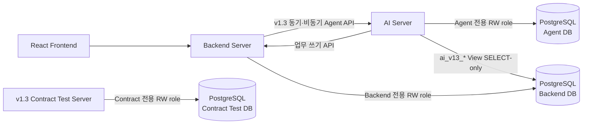

# PostgreSQL 운영 전환 상태와 TODO

- 갱신일: 2026-07-29
- 상태: 로컬 테스트베드 전환·레거시 데이터 이관·SQLite 폐기 완료
- 범위:
  - AI Internal DB (`AGENT_DATABASE_URL`)
  - Backend DB (`SYSTEM_DATABASE_URL`)
  - AI의 Backend Read-only 연결 (`BACKEND_READ_DATABASE_URL`)
  - v1.3 Contract Test Server 전용 DB (`CONTRACT_DATABASE_URL`)

## 완료 증적

- [x] Agent 데이터 8행을 PostgreSQL로 복사하고 count/digest 불일치 0건을
  확인했다.
- [x] Backend/System 데이터 14,702행을 PostgreSQL로 복사하고 count/digest
  불일치 0건을 확인했다.
- [x] 기존 Backend Trace 31건과 Step 86건을 Agent PostgreSQL로 병합했다.
- [x] 병합 후 Agent 원장의 총계는 Trace 51건, Step 145건이며 이관 원본과
  양방향 차집합 불일치가 0건이다.
- [x] Trace 이관 검증 receipt가 기록되었고 검증 상태는 `true`다.
- [x] Backend PostgreSQL에서 레거시 Trace·PHR 테이블이 0개임을 확인했다.
- [x] `DRAnswer_Project` 아래 SQLite DB·WAL·SHM 데이터 파일이 0개임을
  확인했다.
- [x] 서비스 runtime, fallback, 로컬 테스트와 Playwright에서 SQLite를
  사용하지 않는다.
- [x] Agent DB를 Trace·Step·Tool 실행·token usage·비용 기록의 단일 원장으로
  확정했다.
- [x] 두 DB에 누적된 테스트 격리 스키마를 제거하고 `public`만 남겼다.
- [x] 제거된 PHR·Backend Trace·conversation 호환 migration 이력도
  `schema_migrations`에서 정리했다.
- [x] `dranswer_agent_20260729_v13_clean_final.dump`와
  `dranswer_system_20260729_v13_clean_final.dump`를 별도 DB에 복원해 위
  조건을 다시 검증했다.
- [x] Contract Test Server의 SQLite request 1건과 callback 0건을 전용
  `dranswer_contract` PostgreSQL로 이관했고,
  `dranswer_contract_20260729_v13_clean_final.dump`를 별도 DB에 복원해
  schema version 1과 같은 count/hash를 검증했다.
- [x] 최종 Agent DB에는 Trace 53건과 Step 153건이 있고, 그중 이관된
  Backend Trace 31건과 Step 86건의 중복·고아 행이 0건이다.
- [x] Agent DB의 `conversation_id` 컬럼·인덱스·constraint와 Backend 업무
  JSON의 `trace_id` 키가 모두 0건이다.
- [x] 폐기된 Agent `fallback_reason` 컬럼을 제거하고 최종 답변 출처는
  `final_answer_source` 하나로 통일했다.

SQLite importer와 Backend Trace 병합기는 완료된 일회성 전환 도구이므로
저장소에서 제거했다. 이후 데이터 복구와 rollback은 PostgreSQL
backup/PITR만 사용한다.

## 확정 구조

`ai_v13_*`는 공개 HTTP v1.3과 함께 도입된 View 이름이며, 현재 내부
PostgreSQL Read-only 계약 버전은 1.4다. 명칭은 배포 호환을 위해 유지한다.

## 완료된 구현

- [x] Backend와 Agent runtime DB를 PostgreSQL로 제한했다.
- [x] Backend/Agent migration을 API·worker 시작과 분리했다.
- [x] 전용 migration role과 runtime role을 분리할 수 있다.
- [x] migration에 PostgreSQL advisory lock을 적용했다.
- [x] runtime은 DDL을 실행하지 않고 schema와 View를 검증한다.
- [x] Agent RW pool과 Backend Read-only pool을 별도 설정으로 관리한다.
- [x] queue claim에 `FOR UPDATE SKIP LOCKED`를 사용한다.
- [x] Backend Read-only role은 승인된 `ai_v13_*` View만 조회한다.
- [x] Backend 업무 쓰기는 Backend API로만 수행한다.
- [x] 공개 ID, payload, 암호문과 의료 원문을 이관 report에 노출하지 않는다.
- [x] 정상·실패 Trace, Step, Tool 실행, token usage와 비용 기록은 생성
  시점부터 3년 보존한 뒤 관련 개인정보와 함께 제거한다.

## 운영 전 남은 작업

### 1. PostgreSQL 권한과 네트워크

- [ ] Agent RW, Backend RW, AI Backend Reader, migration role을 운영에서
  분리한다.
- [ ] `ai_backend_reader`에 대상 database `CONNECT`, schema `USAGE`,
  `ai_v13_*` View `SELECT`만 부여한다.
- [ ] 원본 table, sequence, function과 모든 쓰기·DDL 권한이 거절되는지
  확인한다.
- [ ] `default_transaction_read_only=on`과 고정 `search_path`를 적용한다.
- [ ] PostgreSQL TLS 인증서 검증과 private network 접근을 적용한다.
- [ ] DB secret 회전 및 secret manager 운영 절차를 확정한다.

### 2. Schema와 트랜잭션

- [ ] 외래키와 `ON DELETE` 동작을 전체 schema에서 검증한다.
- [ ] Trace/Tool/멱등성/피드백의 만료 인덱스를 점검한다.
- [ ] 실제 query plan을 기준으로 중복 인덱스를 정리한다.
- [ ] JSONB 전환이 필요하면 저장 값 전체의 JSON 유효성을 먼저 검사한다.
- [ ] Alembic 도입 여부를 결정한다.

### 3. 동시성·장애·성능

- [ ] 동일 `request_id` 동시 요청과 Backend write retry의 멱등성을
  PostgreSQL row lock 환경에서 검증한다.
- [ ] 환자별 동시 채팅이 순차 처리되거나 명시적으로 거절되는지 검증한다.
- [ ] worker crash와 visibility timeout 뒤 작업이 중복 처리되지 않는지
  검증한다.
- [ ] worker 2개 이상의 queue 처리량과 starvation을 측정한다.
- [ ] 목표 동시성 50에서 API, Agent DB, Backend Read DB 부하를 측정한다.
- [ ] DB restart, network 단절, pool 고갈, lock timeout과 deadlock 복구를
  검증한다.
- [ ] 장시간 LLM/HTTP 호출 동안 DB connection을 점유하지 않는지 확인한다.

### 4. Retention·Backup·복구

- [ ] retention을 API startup이 아닌 별도 정기 job으로 실행한다.
- [ ] 3년 보존 정책을 외부 로그 sink에도 적용하고 삭제 결과를 검증한다.
- [ ] 대량 삭제 batch 크기, 실행 주기와 lock 영향을 측정한다.
- [ ] 자동 backup, PITR 보존 기간, RPO/RTO와 책임자를 확정한다.
- [ ] backup 암호화와 최소 1회 staging restore 훈련을 완료한다.
- [ ] 복구 후 worker 재가동 순서와 stale lock 정리 절차를 검증한다.

### 5. 모니터링

- [ ] DB 연결 성공률, pool 사용량과 query latency P50/P95/P99
- [ ] lock wait, deadlock, active/idle connection
- [ ] queue depth, 가장 오래된 pending 작업과 worker heartbeat
- [ ] Trace/Step/Tool 증가량과 retention 삭제량·실패 횟수
- [ ] database 크기, WAL 증가량, table/index bloat
- [ ] backup 성공 여부와 최근 restore 검증 시각

### 6. Staging·Production 전환

- [ ] Backend migration과 `ai_v13_*` View를 Agent보다 먼저 배포한다.
- [ ] 전용 migration 실행 후 API와 worker가 verify-only로 기동하는지
  확인한다.
- [ ] Agent DB, Backend Read DB와 Backend Write API readiness를 통과한다.
- [ ] 동기 채팅, Tool 조회, 사용자 승인 후 쓰기, 미복용 Callback과 일일
  정책 제안 흐름을 실제 HTTP로 검증한다.
- [ ] staging에서 24시간 이상 오류율, latency, lock, queue를 관찰한다.
- [ ] production 변경 시간, 중단 시간, 승인자와 rollback 판단 시점을
  확정한다.
- [ ] canary 통과 후 트래픽을 재개하고 전체 회귀 결과를 보관한다.

## Rollback 원칙

- PostgreSQL에서 신규 쓰기가 시작된 뒤 이전 저장소로 되돌리지 않는다.
- application rollback과 database 복구를 분리한다.
- database rollback은 PostgreSQL snapshot/PITR만 사용한다.
- 복구 뒤 queue 중복 처리, 요청 멱등성과 Backend write 멱등성을 다시
  검증한 후 트래픽을 재개한다.

세부 실행 순서는 `POSTGRESQL_CUTOVER_RUNBOOK.md`를 따른다.
