# 테스트베드 대화 시간축 시퀀스 평가

- 상태: 목표안 D 구현 완료, 배포 적용 대기
- 결정 상태: 업무 시각·물리 기록 시각 분리
- 범위: React Frontend, Backend, Backend DB/read view, AI Server의 대화 시간·조회·정렬
- 비범위: fast 모델 선택과 reasoning 설정

## 0. 구현 결정

이 문서의 개입안 D를 채택했다. 공개 Frontend 및 Backend–AI HTTP v1.3 계약은
유지하고 내부 Backend read 계약을 1.4로 확장했다.

- `chat_messages.conversation_at`: Backend가 결정한 대화 업무 시각
- `chat_messages.recorded_at`: 실제 UTC 기록 시각
- `conversation_sequence`: read view가 `chat_messages.id`를 순서 전용 값으로
  투영하며 외부 API나 LLM payload에는 노출하지 않음
- AI recent-chat: `created_at` cutoff를 제거하고 현재 user의
  `conversation_sequence` 이하로 제한
- `created_at`: 기존 코드·데이터 호환용으로 유지하되 대화 범위 판단에는 미사용
- Frontend: 기존 `display_message_at`과 `sort_sequence` 계약을 그대로 사용

기존 데이터의 `conversation_at`은 `display_at`, `created_at` 순으로 backfill한다.
과거 행의 실제 기록 시각은 완전히 복원할 수 없으므로 `recorded_at`은 사용 가능한
`created_at`을 최선값으로 사용한다. 신규 행부터 두 시간축이 정확히 분리된다.

## 1. 결론부터 보는 개입 위치

현재 문제는 Frontend의 표시나 정렬에서 시작하지 않는다. Frontend는 Backend가
준 `display_message_at`으로 날짜를 표시하고 `sort_sequence`로 확정 메시지를
정렬한다. 실제 컨텍스트 누락은 Backend DB에 서로 다른 시간축으로 저장된
`created_at`을 AI read view와 AI Server가 대화 cutoff로 사용하는 지점에서
발생한다.

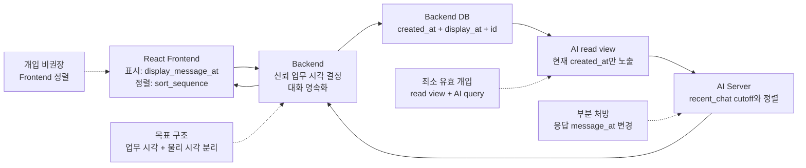

평가의 시작점은 다음과 같다.

- Frontend 단독 수정: AI 컨텍스트 조회에 영향이 없어 해결되지 않는다.
- AI 응답 시각만 변경: 동기 AI 답변 일부는 맞출 수 있으나 proactive 메시지와
  timestamp 의미 혼용이 남는다.
- read view와 AI query 수정: 공개 UI 계약을 유지하면서 직접적인 누락을 막는
  최소 유효 개입이다.
- Backend 시간 모델 분리: 테스트베드와 실서비스를 같은 구조로 운영하려면
  최종적으로 검토할 목표안이다.

## 2. 현재 정상처럼 보이는 1회 대화 시퀀스

기호는 다음과 같다.

- `Tsim`: 테스트베드 시뮬레이션 업무 시각, 예: 2026-04-20 09:30
- `R1`: 첫 AI 응답이 실제로 완료된 UTC 물리 시각
- `seq`: `chat_messages.id`에서 만든 단조 증가 저장 순서

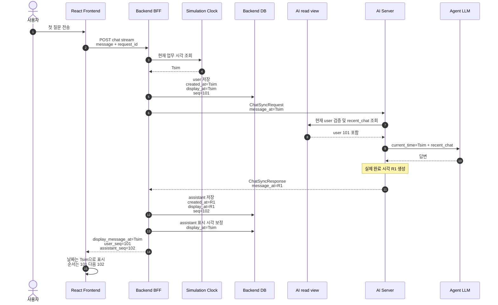

### 이 시퀀스에서 보이는 것

화면만 보면 문제가 없다. user와 assistant 모두 `Tsim`으로 보이고 `seq`가
101, 102이므로 순서도 맞다. 하지만 DB에는 다음 상태가 남는다.

| 행 | `created_at` | `display_at` | `seq` |
|---|---|---|---:|
| user 1 | `Tsim` | `Tsim` | 101 |
| assistant 1 | `R1` | `Tsim` | 102 |

UI 시간축은 `display_at`, AI read 시간축은 `created_at`이므로 같은 대화가
두 가지 시간 순서를 갖는다.

## 3. 두 번째 대화에서 실제로 컨텍스트가 누락되는 시퀀스

시뮬레이션 시계가 대화 중 계속 09:30에 머물러 있다고 가정한다. 실제 서버
시각 `R1`은 `Tsim`보다 뒤다.

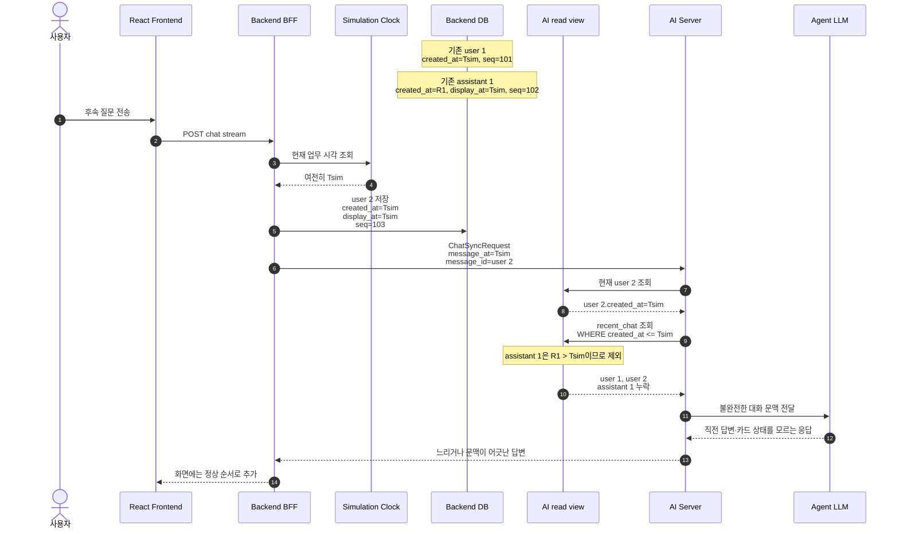

### 장애 효과

- “그 전에는?”, “내가 처음 말한 것은?” 같은 회상 질문에서 assistant 발화가
  보이지 않는다.
- 구조화 카드의 원문 assistant가 빠지면 사용자의 “기록”, “심하다” 같은 짧은
  응답을 잘못 해석할 가능성이 커진다.
- LLM은 누락된 문맥을 추론하려고 하므로 응답시간이 늘거나 관련 없는 과거
  도메인 정보를 답할 수 있다.
- React는 `display_at`과 `sort_sequence`로 올바르게 보이므로 UI만 확인하면
  원인을 찾기 어렵다.
- proactive assistant 메시지도 `created_at`과 `display_at`이 다르면 같은
  방식으로 누락될 수 있다.

## 4. 개입안 F — Frontend 표시·정렬만 변경

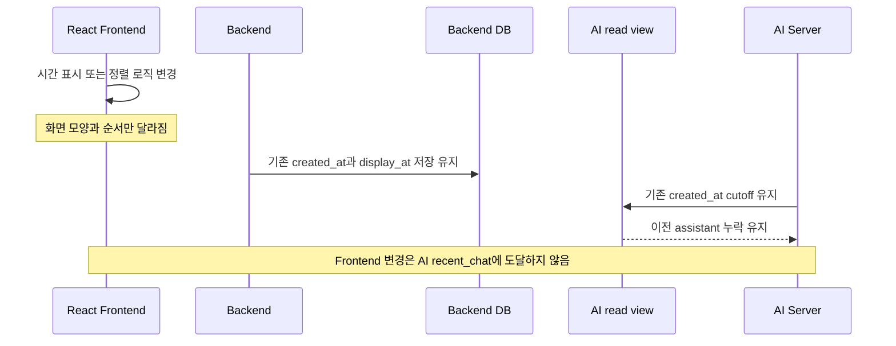

### 평가

- 직접 효과: 화면 표시·낙관적 메시지 정렬 조정
- AI 컨텍스트 효과: 없음
- 영향 범위: React
- 위험: 화면만 정상화되어 서버 문제를 더 감출 수 있음
- 판단: **이번 문제의 수정 지점이 아님**

현재 Frontend는 확정 메시지에 `sort_sequence`가 있으면 이를 우선 사용한다.
여기서 시간 정렬을 다시 강화하면 오히려 안정적인 DB 순서를 약화할 수 있다.

## 5. 개입안 A — AI 응답 `message_at`을 요청 시각으로 맞춤

AI Server가 응답의 `message_at`으로 물리 완료 시각 `R1` 대신 요청의 `Tsim`을
반환하는 안이다.

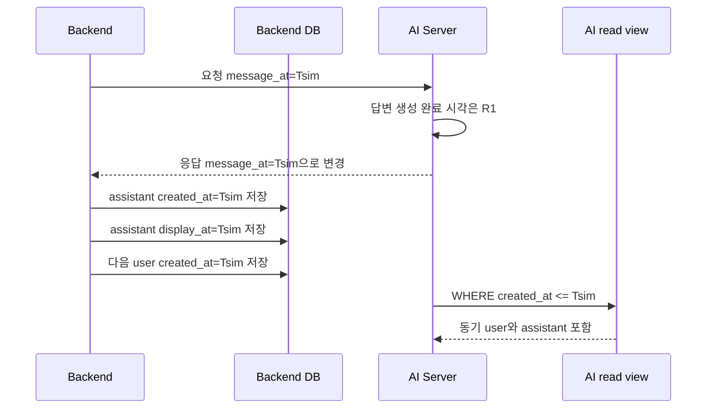

### 평가

- 직접 효과: 동기 채팅으로 생성된 assistant가 다음 recent-chat cutoff에 포함됨
- 변경 위치: `shared/chat_contracts.py::chat_sync_response`
- 공개 계약 스키마 변화: 없음
- 의미 변화: AI 응답 `message_at`이 “응답 처리 시각”에서 “대화 업무 시각”으로 바뀜
- 장점: 코드 변경이 작고 동기 채팅 재현 문제를 빠르게 막을 수 있음
- 한계:
  - proactive 메시지 등 다른 생성 경로의 `created_at` 혼용은 별도로 고쳐야 함
  - 실제 생성 완료 시각을 공개 응답에서 잃음
  - `created_at`이 물리 저장 시각인지 업무 시각인지 더 모호해짐
- 판단: **단독 최종안으로는 비권장**

실제 응답 지연은 Agent Trace와 응답 로그로 측정할 수 있지만, 공개
`message_at`의 기존 의미를 바꾸는 결정은 별도 계약 검토가 필요하다.

## 6. 개입안 B — Backend가 assistant `created_at`만 업무 시각으로 저장

AI 응답 `message_at=R1`은 유지하되, Backend가 assistant를 저장할 때 triggering
user의 업무 시각 `Tsim`을 `created_at`에 넣는 안이다.

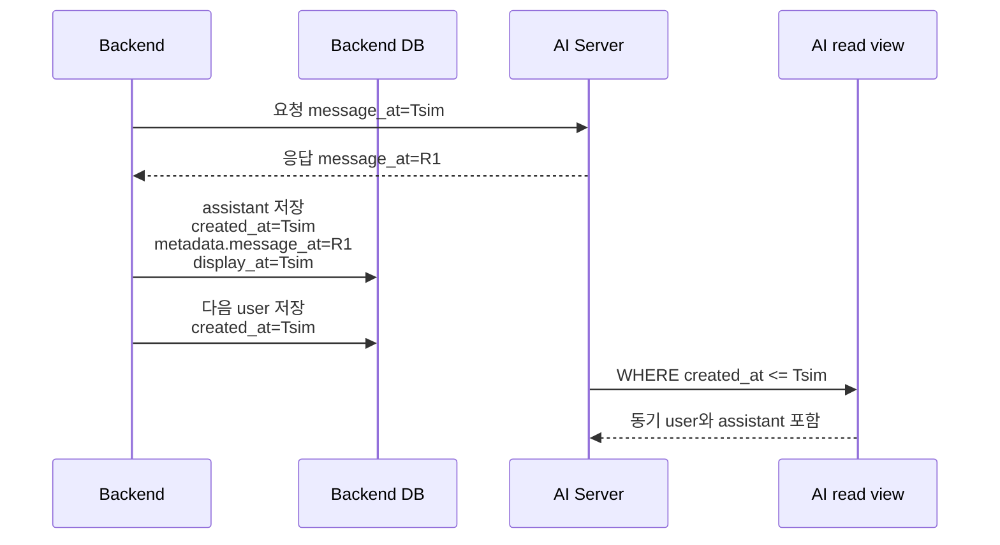

### 평가

- 직접 효과: 동기 assistant 컨텍스트 누락을 Backend 내부 변경으로 막음
- 변경 위치: `system_app/services/backend_chat_service.py`
- 공개 계약 영향: 없음
- 장점: AI 응답 계약의 물리 완료 시각을 유지할 수 있음
- 한계:
  - `created_at`이 실제 insert 시각이라는 일반적인 의미를 잃음
  - proactive 메시지를 포함한 모든 `ChatMessage` 생성 경로를 같은 규칙으로
    맞추지 않으면 다시 혼용됨
  - 같은 `Tsim`에 여러 turn이 생기므로 별도 안정 순서가 계속 필요함
- 판단: **긴급 완화책은 될 수 있지만 시간 모델을 명확히 하지 못함**

## 7. 개입안 C — read view에 대화 시각·순서를 명시

DB 스키마를 즉시 늘리지 않고, 현재 `display_at`을 AI read view에서
`conversation_at`으로 투영하고 내부 저장 순서를 `conversation_sequence`로
노출하는 과도기 안이다. AI recent-chat은 `created_at` 대신 sequence cutoff와
conversation time을 사용한다.

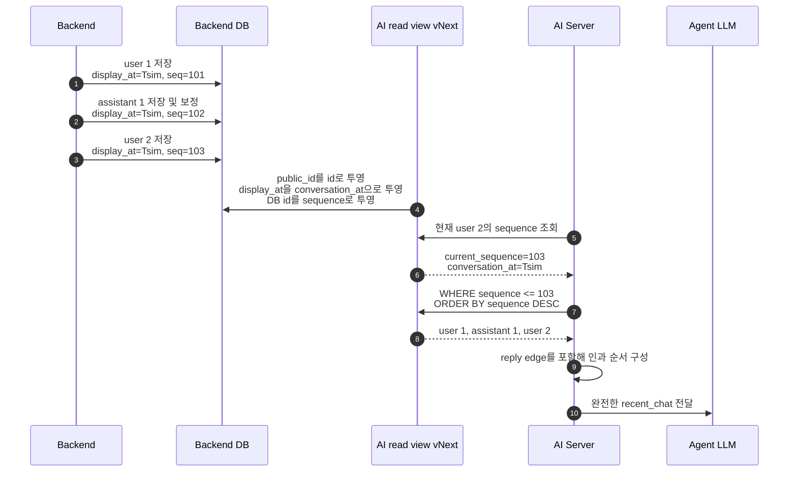

### 평가

- 직접 효과: 실제 시각과 시뮬레이션 시각이 달라도 현재 메시지까지의 대화를
  안정적으로 포함
- 변경 위치:
  - `shared/backend_read_contract.py`
  - Backend read view migration
  - `agent_app/tools/backend_query.py::validate_chat_message`
  - read contract/OpenAPI 성격의 문서와 회귀 테스트
- Frontend 영향: 없음
- 공개 Backend–AI chat v1.3 영향: 없음
- 내부 Backend DB read 계약: 버전 변경 필요
- 장점:
  - 현재 문제를 일으키는 cutoff를 직접 제거
  - 같은 09:30에 여러 turn이 생겨도 sequence로 안정적으로 자름
  - 현재 메시지 이후에 생성된 같은 시각 행을 제외할 수 있음
- 한계:
  - `display_at`이라는 UI 목적 컬럼을 Agent의 업무 시각으로 재사용함
  - DB의 `created_at` 의미 혼용 자체는 남음
  - 내부 sequence 노출의 최소권한·명명 원칙을 합의해야 함
- 판단: **공개 계약을 건드리지 않는 최소 유효 개입안**

`conversation_sequence`는 리소스 식별자가 아니라 patient-scoped read 순서로만
사용하고 외부 API나 LLM-safe payload에는 노출하지 않는 것이 전제다.

## 8. 개입안 D — 업무 발생 시각과 물리 기록 시각을 분리

Agent Server를 테스트베드에서 떼어 실서비스에도 사용하려는 목적까지 고려한
목표 구조다. Backend가 환경에 맞는 신뢰 clock source를 선택하되 저장·조회
계약은 동일하게 유지한다.

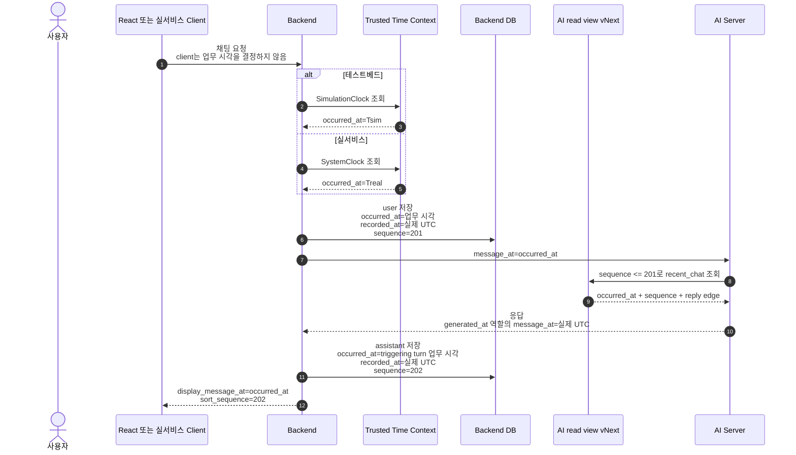

### 목표 시간 의미

| 의미 | 제안 필드 | clock source | 사용처 |
|---|---|---|---|
| 업무상 발생 시각 | `occurred_at` 또는 `conversation_at` | 테스트베드 SimulationClock, 실서비스 SystemClock | 날짜 구간, Agent current time, 화면 표시 |
| 물리 기록 시각 | `recorded_at` | 서버 UTC wall clock | 감사, 운영 장애 분석, 지연 측정 보조 |
| 인과·저장 순서 | `conversation_sequence` | Backend DB | recent-chat cutoff, 안정 정렬 |
| UI 표시 시각 | `display_message_at` | 업무 발생 시각에서 projection | React 표시 |

### 평가

- 직접 효과: 테스트베드와 실서비스의 차이를 clock source 한 곳으로 제한
- 변경 위치:
  - Backend `ChatMessage` 시간 모델과 모든 생성 경로
  - migration/backfill
  - Backend read view와 AI query
  - UI history projection
  - 시간 계약 문서와 회귀 테스트
- Frontend 동작 영향: 원칙적으로 없음. 기존 `display_message_at`과
  `sort_sequence`를 계속 받을 수 있음
- AI 공개 chat 계약 영향: `message_at`의 요청/응답 의미를 문서로 명확히 해야
  하지만 스키마를 바꾸지 않고도 유지 가능
- 장점:
  - 테스트베드 전용 SQL 분기가 필요 없음
  - 물리 감사 시각을 잃지 않음
  - proactive, 동기 chat, retry/replay를 같은 규칙으로 통합 가능
  - 분리 배포된 Agent Server가 Backend의 신뢰 업무 시각만 사용하게 됨
- 비용:
  - DB migration과 기존 데이터 backfill 정책 필요
  - 모든 `ChatMessage` write path 감사 필요
  - read contract 버전과 배포 순서 관리 필요
- 판단: **실서비스 재사용을 고려한 권장 목표안**

## 9. 개입안 비교

| 안 | 실제 누락 해결 | 테스트베드/실서비스 공통성 | 공개 API 변경 | DB/read 계약 영향 | 잔여 위험 | 평가 |
|---|---|---|---|---|---|---|
| F. Frontend만 수정 | 아니오 | 해당 없음 | 없음 | 없음 | AI 컨텍스트 누락 지속 | 제외 |
| A. AI 응답 시각 변경 | 일부 | 낮음 | 의미 변경 | 작음 | proactive 경로, 시간 의미 혼용 | 단독 비권장 |
| B. Backend created_at 보정 | 일부 | 중간 | 없음 | write 경로 변경 | created_at 의미 혼용 | 긴급 완화 후보 |
| C. view + sequence query | 예 | 중간 | 없음 | 내부 read 계약 변경 | display 의미와 Agent 의미 결합 | 최소 유효안 |
| D. 업무/물리 시각 분리 | 예 | 높음 | 의미 문서화 | 스키마·read 계약 변경 | migration 비용 | 권장 목표안 |

## 10. 권장 진행 순서

### 단계 0 — 변경 전 증거 고정

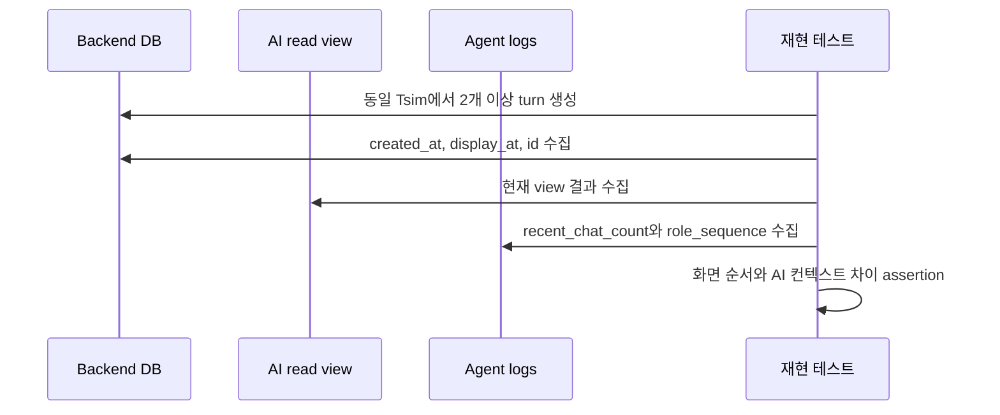

기존 로깅의 `agent_backend_chat_context_loaded`로 반환 개수와 역할 순서를
확인하고, DB 원본·view 결과를 함께 보존한다.

### 단계 1 — 최소안과 목표안 중 선택

- 빠르게 테스트를 정상화해야 하고 DB migration을 나중에 할 경우: C
- Agent Server 실사용 분리를 가까운 시점에 준비할 경우: D
- B를 먼저 쓰려면 제거 시점과 D로의 이관 계획을 동시에 정한다.

### 단계 2 — 배포 호환 순서

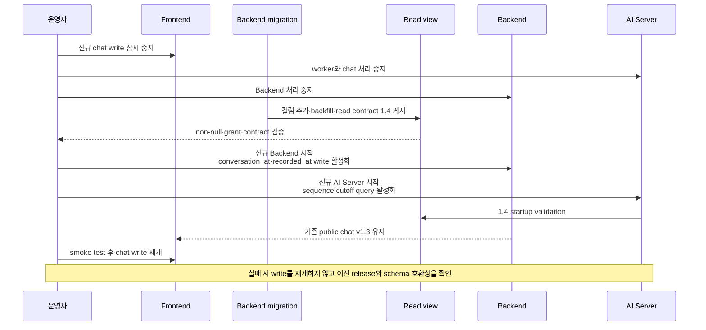

현재 구현은 D를 선택했으며 **짧은 쓰기 중지 하의 coordinated migration**을
기본 배포 방식으로 한다. 새 `conversation_at` 컬럼이 존재하는 동안 구 Backend가
테스트베드 메시지를 쓰면 DB 기본값인 물리 시각이 들어갈 수 있으므로, migration과
신규 Backend write 활성화 사이에 구 Backend 쓰기를 허용하지 않는다. AI Server는
read contract 1.4를 startup에서 검증하고 불일치 시 fail-closed한다. Frontend와
외부 Backend–AI chat v1.3 계약은 변경하지 않는다.

무중단 rolling 배포가 필요해지면 이번 migration을 그대로 순차 적용하지 말고,
nullable shadow column 추가 → 구·신 Backend dual-write → backfill → read view 전환
→ NOT NULL 강제의 expand/contract migration으로 별도 분리해야 한다.

## 11. 변경 파일과 영향 영역

### C를 선택할 경우

| 영역 | 주요 위치 | 변경 내용 |
|---|---|---|
| read 계약 | `shared/backend_read_contract.py` | `conversation_at`, `conversation_sequence` projection |
| migration | `system_app/migrations.py` | view 재생성·권한·계약 버전 |
| AI 조회 | `agent_app/tools/backend_query.py` | sequence cutoff와 안정 정렬 |
| 문서 | `docs/BACKEND_V13_READ_SCHEMA.json` 등 | 내부 read 계약 갱신 |
| 테스트 | read contract, recent-chat, PostgreSQL boundary tests | 같은 시각 다중 turn 및 누락 회귀 |

### D를 선택할 경우 추가 영역

| 영역 | 주요 위치 | 변경 내용 |
|---|---|---|
| DB 모델 | `system_app/models.py` | 업무 시각·물리 기록 시각 정의 |
| 동기 chat write | `system_app/services/backend_chat_service.py` | user/assistant 시간 상속 규칙 |
| proactive write | `system_app/services/timeline_service.py` 등 | 발생 이벤트 업무 시각 사용 |
| UI BFF | `system_app/routes/ui_api.py` | Trusted Time Context와 projection |
| history read | `system_app/services/ui_view_service.py` | 날짜 구간과 순서의 명시적 필드 사용 |
| 데이터 이관 | migration/backfill 도구 | 기존 `created_at`, `display_at` 해석 정책 |

Frontend는 API 계약을 유지하는 한 수정 대상이 아니다. 필드 이름을 더 명확히
바꾸는 작업은 기능 수정과 분리해 후속 계약 버전에서 논의한다.

## 12. 승인 테스트 시퀀스

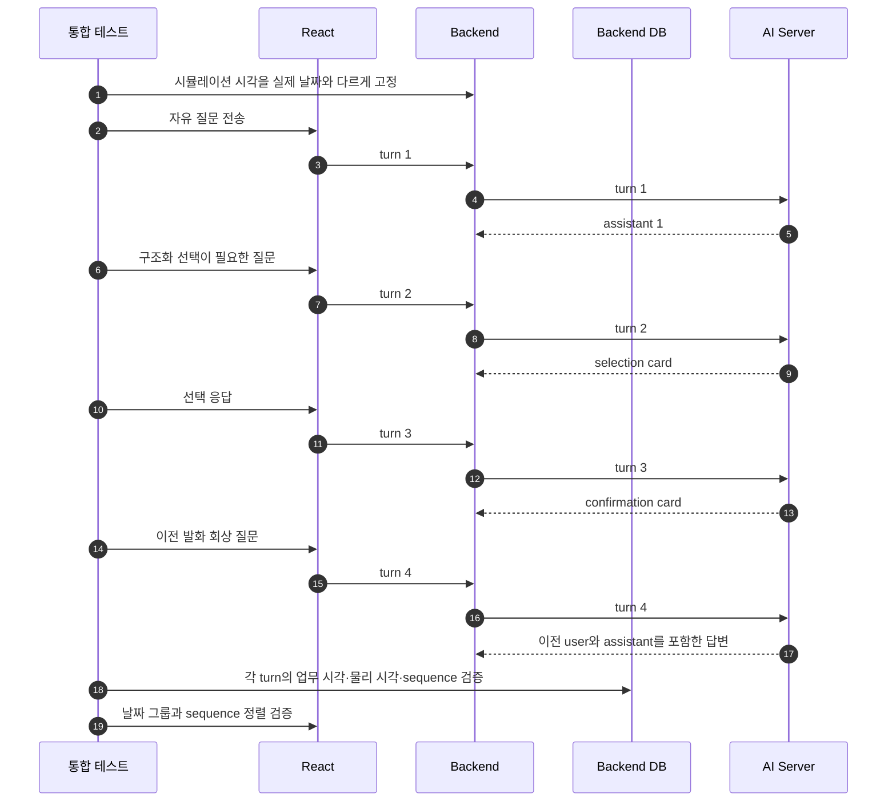

승인 조건은 다음과 같다.

- 시뮬레이션 날짜와 실제 날짜가 달라도 현재 user까지의 모든 이전 assistant가
  recent-chat에 포함된다.
- 같은 시뮬레이션 분에 여러 turn이 있어도 미래 행이 포함되지 않고 순서가
  안정적이다.
- structured reply edge가 원본 assistant와 user를 계속 연결한다.
- proactive 메시지와 동기 assistant에 동일한 시간 규칙이 적용된다.
- React의 날짜 그룹과 확정 순서는 기존과 동일하다.
- 실서비스 clock source로 같은 테스트를 실행해 별도 SQL 분기가 없음을
  확인한다.
- 실제 응답시간과 저장 지연은 업무 시각과 별도로 관측할 수 있다.

## 13. 확정된 구현 결정

- [x] 과도기 C가 아니라 목표안 D를 구현한다.
- [x] `created_at`은 기존 호환용으로 유지하고 물리 저장 시각은
  `recorded_at`으로 명시한다.
- [x] chat 업무 시각 필드 이름은 `conversation_at`으로 한다.
- [x] DB id는 외부 식별자가 아닌 내부 정렬 전용
  `conversation_sequence`로 read view에 projection한다.
- [x] 외부 Backend–AI chat v1.3의 `message_at` 계약은 변경하지 않는다.
- [x] 기존 `conversation_at`은 `display_at`, `created_at` 순서로 backfill하고,
  `recorded_at`은 복원 가능한 최선의 값인 `created_at`으로 backfill한다.
- [x] 내부 read contract는 1.4로 올리되 배포 호환성을 위해 view 이름의
  `ai_v13_*` prefix는 유지한다.
- [x] migration은 쓰기 중지 하에 Backend, AI Server 순서로 전환한다.
- [ ] 무중단 rolling 배포가 필요해질 경우 expand/contract migration을 별도
  설계한다.
