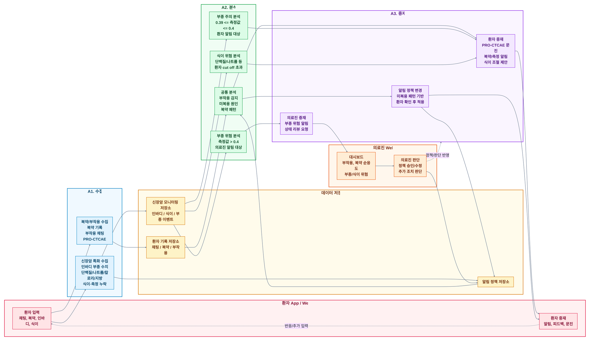
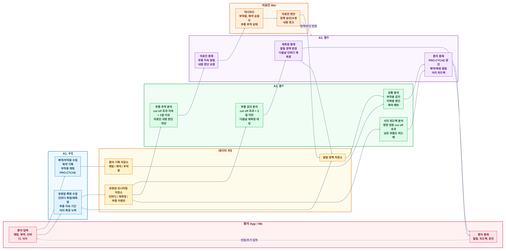

# 암종별 단순화 Agentic AI Care Loop

신장암과 유방암을 각각 별도 Mermaid 구성도로 분리했습니다.

- 신장암 Mermaid 원본: [simplified_kidney_cancer_care_loop.mmd](simplified_kidney_cancer_care_loop.mmd)
- 유방암 Mermaid 원본: [simplified_breast_cancer_care_loop.mmd](simplified_breast_cancer_care_loop.mmd)

## 신장암

## 유방암

